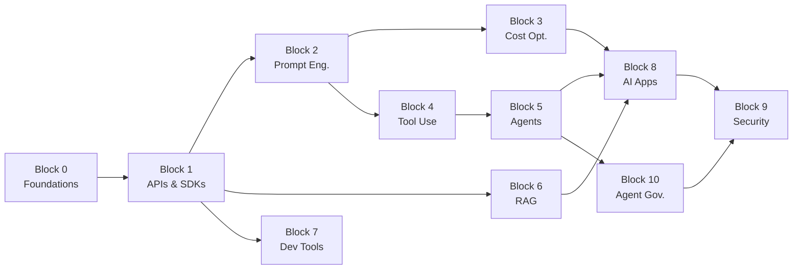

# AI Know-How — Course Outline

> A practical, developer-first course to understand and leverage AI in day-to-day coding.
> Stack: JavaScript / TypeScript · OpenAI · Anthropic

---

## Block 0 — Foundations: How LLMs Actually Work

Before using AI tools effectively you need a mental model of what is happening under the hood.

| Topic                       | Key concepts                                                    |
| --------------------------- | --------------------------------------------------------------- |
| Tokenization & embeddings   | BPE, sub-word tokens, vector spaces                             |
| Transformer architecture    | Attention, self-attention, positional encoding                  |
| Pre-training vs fine-tuning | Base models, RLHF, instruction tuning                           |
| Context windows & memory    | Token limits, chunking strategies, context management           |
| Inference parameters        | Temperature, top-p, frequency penalty, stop sequences           |
| Model landscape             | GPT-4o, Claude 3.5, Gemini, open-source models (Llama, Mistral) |

---

## Block 1 — Talking to Models: APIs & SDKs

Hands-on interaction with LLM APIs from JavaScript/TypeScript.

| Topic                           | Key concepts                                                  |
| ------------------------------- | ------------------------------------------------------------- |
| OpenAI API                      | Chat completions, streaming, function calling                 |
| Anthropic API                   | Messages API, system prompts, tool use                        |
| Authentication & key management | Environment variables, secret rotation, `.env` best practices |
| Token counting & pricing        | `tiktoken`, estimating costs before calling                   |
| Streaming responses             | SSE, chunked transfer, real-time UX                           |
| Error handling & retries        | Rate limits, exponential backoff, circuit breaker patterns    |

---

## Block 2 — Prompt Engineering

The art and science of getting the output you actually want.

| Topic                                 | Key concepts                                            |
| ------------------------------------- | ------------------------------------------------------- |
| Zero-shot, few-shot, chain-of-thought | Prompting strategies and when to use each               |
| System vs user vs assistant roles     | Role architecture, persona shaping                      |
| Output formatting                     | JSON mode, structured output, schema enforcement        |
| Prompt templates & variables          | Dynamic prompt construction, template engines           |
| Guardrails & validation               | Input sanitization, output validation, refusal handling |
| Prompt versioning                     | Tracking prompt changes, A/B testing prompts            |

---

## Block 3 — Cost Optimization

AI can get expensive fast. This block focuses on keeping it under control.

| Topic                      | Key concepts                                                 |
| -------------------------- | ------------------------------------------------------------ |
| Model tiering strategies   | When to use GPT-4o vs GPT-4o-mini vs Claude Haiku            |
| Caching responses          | Semantic caching, deterministic caching, cache invalidation  |
| Prompt compression         | Reducing token count without losing quality                  |
| Batching & queuing         | Batch API, request aggregation                               |
| Monitoring & budgeting     | Usage dashboards, spending alerts, per-feature cost tracking |
| Self-hosted / local models | Ollama, LM Studio, when local makes sense                    |

---

## Block 4 — Function Calling & Tool Use

Giving LLMs the ability to interact with the outside world.

| Topic                    | Key concepts                                          |
| ------------------------ | ----------------------------------------------------- |
| OpenAI function calling  | Defining functions, JSON Schema, parsing calls        |
| Anthropic tool use       | Tool definitions, tool results, multi-turn tool loops |
| Building a tool registry | Dynamic tool discovery, schema generation             |
| Chaining tool calls      | Sequential and parallel tool execution                |
| Safety & sandboxing      | Limiting tool capabilities, confirmation flows        |
| Real-world examples      | Database queries, API calls, file operations          |

---

## Block 5 — Agents

Autonomous systems that plan, act, and iterate toward a goal.

| Topic               | Key concepts                                                         |
| ------------------- | -------------------------------------------------------------------- |
| What is an agent?   | Agent loop, plan → act → observe → reflect                           |
| ReAct pattern       | Reasoning + Acting, thought-action-observation traces                |
| Agent frameworks    | LangChain, LangGraph, Vercel AI SDK, CrewAI                          |
| Memory & state      | Short-term (conversation), long-term (vector stores), working memory |
| Multi-agent systems | Agent collaboration, delegation, role specialization                 |
| Debugging agents    | Logging traces, LangSmith, observability                             |

---

## Block 6 — RAG (Retrieval-Augmented Generation)

Grounding LLM outputs in your own data.

| Topic                | Key concepts                                          |
| -------------------- | ----------------------------------------------------- |
| Embeddings deep dive | OpenAI embeddings, similarity search, cosine distance |
| Vector databases     | Pinecone, ChromaDB, pgvector, Qdrant                  |
| Chunking strategies  | Fixed-size, recursive, semantic, document-aware       |
| Retrieval pipeline   | Query → embed → search → rerank → generate            |
| Hybrid search        | Combining keyword (BM25) with vector search           |
| Evaluation           | Relevance metrics, faithfulness, answer correctness   |

---

## Block 7 — AI-Powered Dev Tools

Tools that already exist and how to squeeze the most out of them.

| Topic                     | Key concepts                                     |
| ------------------------- | ------------------------------------------------ |
| AI coding assistants      | GitHub Copilot, Cursor, Cody, Gemini Code Assist |
| AI in the terminal        | Aider, Warp, AI-enhanced shells                  |
| Code review & refactoring | AI-assisted PR reviews, automated refactoring    |
| Testing with AI           | Test generation, fuzzing, mutation testing       |
| Documentation generation  | Docstrings, READMEs, API docs from code          |
| Custom IDE extensions     | Building your own Copilot-style tools            |

---

## Block 8 — Building AI-Powered Applications

Putting it all together: shipping real products with AI inside.

| Topic                        | Key concepts                                          |
| ---------------------------- | ----------------------------------------------------- |
| Architecture patterns        | AI as a service, AI as middleware, AI-native apps     |
| Conversation UIs             | Chat interfaces, message history, streaming UI        |
| Content generation pipelines | Summarization, translation, content moderation        |
| AI workflows                 | Multi-step AI pipelines, conditional branching        |
| User feedback loops          | RLHF-lite, thumbs up/down, fine-tuning from feedback  |
| Deployment & scaling         | Edge functions, serverless, queue-based architectures |

---

## Block 9 — Security, Ethics & Best Practices

Responsible AI usage in production.

| Topic                    | Key concepts                                               |
| ------------------------ | ---------------------------------------------------------- |
| Prompt injection         | Direct/indirect injection, defense strategies              |
| Data privacy             | PII handling, data retention, GDPR considerations          |
| Output safety            | Content filtering, bias detection, toxic output prevention |
| Hallucination mitigation | Grounding, fact-checking, confidence scores                |
| Licensing & IP           | Model license terms, generated code ownership              |
| Responsible disclosure   | Bug bounties, AI safety reporting                          |

---

## Block 10 — Agent Security & Governance

Advanced controls for autonomous systems.

| Topic                       | Key concepts                                                 |
| --------------------------- | ------------------------------------------------------------ |
| Agent Authorization & RBAC  | Defining permission boundaries, least privilege for agents   |
| Execution Sandboxing        | Docker, gVisor, WebContainers, isolating code execution       |
| File & Network Controls     | Scoped FS access, network allow-lists, egress filtering      |
| Human-in-the-loop (HITL)    | Approval workflows, manual intervention, verification steps  |
| Audit Logging & Tracing     | Immutable action logs, decision-trail reconstruction        |
| Recursive Security          | Multi-step prompt injection defense, agent-to-agent security |

---

## Suggested Learning Path

> **Blocks 0–2** are sequential prerequisites. After that, blocks can be explored in parallel depending on interest, converging again at **Block 8** and then covering the core security and governance in **Blocks 9 and 10**.
