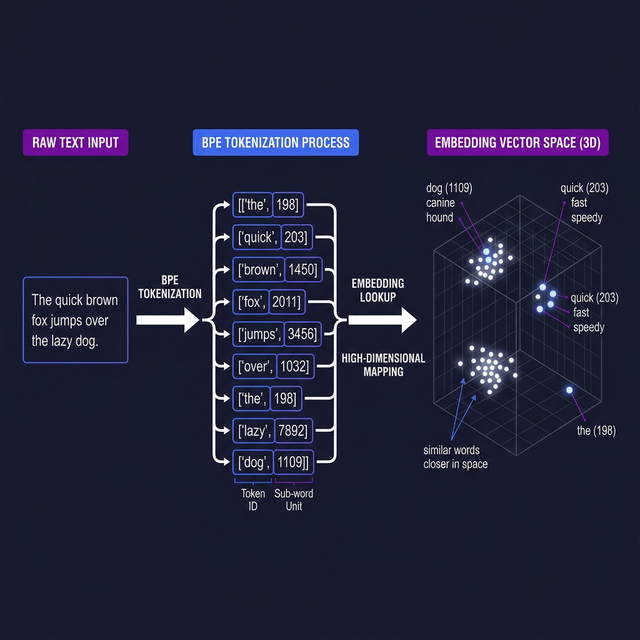

# Tokenization & Embeddings

> Learn how LLMs break text into tokens, then map them into numerical vectors that capture meaning.

## Introduction

Every time you send a message to ChatGPT or Claude, the first thing that happens is **tokenization** — your text gets chopped into small pieces called _tokens_. These tokens aren't always full words; they can be sub-words, individual characters, or even byte sequences. Understanding this step matters because it directly affects pricing (you pay per token), context limits (measured in tokens), and sometimes the quality of output.

Once text is tokenized, each token is converted into an **embedding** — a high-dimensional numerical vector. These vectors live in a _vector space_ where proximity encodes semantic similarity. The word "cat" ends up near "kitten" and far from "database". This is the mathematical foundation that lets LLMs "understand" language.

## Core Concepts

### Byte-Pair Encoding (BPE)

Most modern LLMs use **BPE** (Byte-Pair Encoding) or a variant of it. BPE starts with individual characters and iteratively merges the most frequent pairs into new tokens. The result is a vocabulary that balances between character-level (very general but long sequences) and word-level (compact but huge vocabulary) representations.

```typescript
// Conceptual example: how BPE might tokenize a sentence
// Model vocabulary has learned common sub-word units

const input = "tokenization is fascinating";

// Possible BPE split (actual splits depend on the trained vocabulary):
const tokens = ["token", "ization", " is", " fasc", "inating"];

// Each token maps to an integer ID in the vocabulary
const tokenIds = [5765, 2065, 318, 33105, 15464];
```

A practical consequence: uncommon words get split into more tokens. "Tokenization" might be two tokens, but "the" is always one. This is why API costs vary with text complexity.

### Sub-word Tokens

Sub-word tokenization means the model doesn't need to have seen an exact word before to process it. For example, even a made-up word like "untokenifiable" can be split into familiar pieces: `["un", "token", "ifi", "able"]`. This gives LLMs the ability to handle neologisms, compound words, and even code variables.

```typescript
// Example: counting tokens matters for cost estimation
// OpenAI's tiktoken library lets you count tokens before calling the API

// npm install tiktoken
import { encoding_for_model } from "tiktoken";

const encoder = encoding_for_model("gpt-4o");
const text = "How many tokens is this sentence?";
const tokens = encoder.encode(text);

console.log(`Token count: ${tokens.length}`); // e.g., 7
console.log(`Token IDs: ${tokens}`);

encoder.free(); // Clean up WASM resources
```

### Vector Spaces and Embeddings

After tokenization, each token ID is looked up in an **embedding table** — a massive matrix where each row is a vector (typically 768 to 12,288 dimensions). These vectors are learned during training and encode semantic relationships.

The magic is that arithmetic on these vectors produces meaningful results. The classic example: `vector("king") - vector("man") + vector("woman") ≈ vector("queen")`.

```typescript
// Using OpenAI's embedding API to get vectors for text
import OpenAI from "openai";

const openai = new OpenAI();

async function getEmbedding(text: string): Promise<number[]> {
  const response = await openai.embeddings.create({
    model: "text-embedding-3-small",
    input: text,
  });
  return response.data[0].embedding; // Array of 1536 numbers
}

// Cosine similarity: how "close" two texts are in meaning
function cosineSimilarity(a: number[], b: number[]): number {
  const dot = a.reduce((sum, val, i) => sum + val * b[i], 0);
  const magA = Math.sqrt(a.reduce((sum, val) => sum + val * val, 0));
  const magB = Math.sqrt(b.reduce((sum, val) => sum + val * val, 0));
  return dot / (magA * magB);
}
```

## Visual Aids



## Key Takeaways

- **Tokens are the atomic unit** of LLMs — pricing, context limits, and processing all revolve around them
- **BPE** is the dominant tokenization strategy: it merges frequent character pairs into a fixed-size vocabulary
- **Embeddings** convert tokens into numerical vectors where distance encodes meaning
- **Cosine similarity** is the standard way to measure how close two embeddings are
- Token counts vary by model — always count tokens before sending requests to estimate cost

## Further Reading

- [OpenAI Tokenizer tool](https://platform.openai.com/tokenizer) — visualize how text is tokenized
- [Hugging Face — Summary of the tokenizers](https://huggingface.co/docs/transformers/tokenizer_summary)
- [Original BPE paper — Sennrich et al. 2016](https://arxiv.org/abs/1508.07909)
- [OpenAI Embedding guide](https://platform.openai.com/docs/guides/embeddings)

