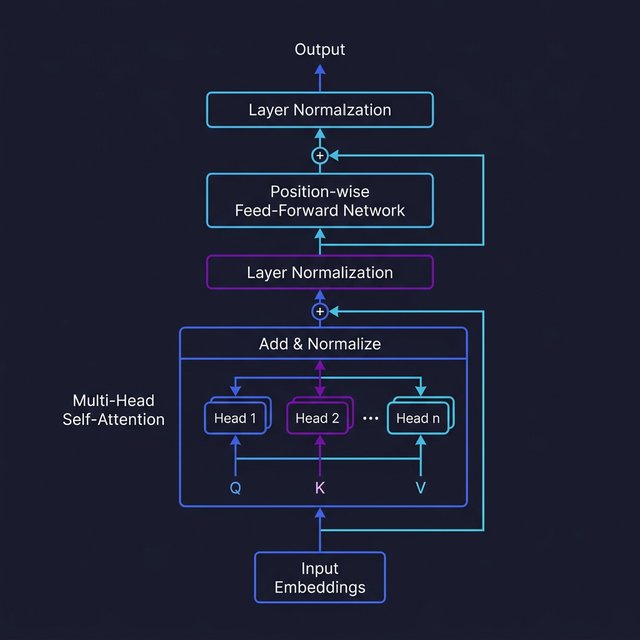

import Quiz from '@site/src/components/Quiz';

# Transformer Architecture

> Understand the core architecture that powers every modern LLM — the Transformer.

## Introduction

The Transformer, introduced in the 2017 paper "Attention Is All You Need," revolutionized natural language processing. Before Transformers, models processed text sequentially (one word at a time), which was slow and made it hard to learn relationships between distant words. Transformers process all tokens **in parallel** and use a mechanism called _attention_ to figure out which parts of the input are relevant to each other.

Every LLM you interact with today — GPT-4o, Claude, Gemini, Llama — is a Transformer (or a variant). Understanding this architecture gives you intuition about why LLMs behave the way they do: why they sometimes "forget" earlier context, why they're good at pattern matching, and why bigger models tend to be better.

## Core Concepts

### Self-Attention

**Self-attention** is the mechanism that lets each token "look at" every other token in the input and decide how much weight to give each one. Think of it like reading a sentence where every word can ask "which other words in this sentence are relevant to understanding _me_?"

For example, in "The cat sat on the mat because **it** was tired," self-attention helps the model figure out that "it" refers to "cat," not "mat."

Mechanically, each token is projected into three vectors — **Query** (Q), **Key** (K), and **Value** (V). Attention scores are computed as the dot product of Q and K, then used to weight the V vectors:

```typescript
// Simplified self-attention in pseudocode
function selfAttention(tokens: number[][]): number[][] {
  // Each token is projected into Q, K, V vectors
  const Q = tokens.map((t) => matMul(t, weightsQ));
  const K = tokens.map((t) => matMul(t, weightsK));
  const V = tokens.map((t) => matMul(t, weightsV));

  // Attention scores: how relevant is token j to token i?
  const scores = Q.map((q, i) =>
    K.map((k, j) => dotProduct(q, k) / Math.sqrt(dimension)),
  );

  // Softmax to normalize scores into probabilities
  const weights = scores.map((row) => softmax(row));

  // Weighted sum of values = the output for each token
  return weights.map((row) => weightedSum(row, V));
}
```

### Multi-Head Attention

Rather than computing attention once, Transformers use **multi-head attention** — multiple attention mechanisms running in parallel, each learning to focus on different kinds of relationships. One head might learn syntactic patterns (subject-verb agreement), another semantic patterns (topic relevance), and another positional patterns (nearby words).

Think of it like a team of analysts each reading the same document but looking for different things, then combining their notes.

### Positional Encoding

Since Transformers process all tokens in parallel (no inherent order), they need a way to know that "The cat sat" is different from "sat cat The." **Positional encodings** are vectors added to each token's embedding that encode its position in the sequence.

Original Transformers used sinusoidal functions. Modern models often use **Rotary Position Embeddings (RoPE)** or learned position embeddings that better handle long sequences.

```typescript
// Conceptual: sinusoidal positional encoding
function positionalEncoding(position: number, dimension: number): number[] {
  const encoding: number[] = [];
  for (let i = 0; i < dimension; i++) {
    const angle =
      position / Math.pow(10000, (2 * Math.floor(i / 2)) / dimension);
    encoding.push(i % 2 === 0 ? Math.sin(angle) : Math.cos(angle));
  }
  return encoding;
}
```

### The Full Transformer Block

A single Transformer block stacks these components:

1. **Multi-head self-attention** — tokens attend to each other
2. **Add & normalize** — residual connection + layer normalization
3. **Feed-forward network** — a simple two-layer neural network applied to each token independently
4. **Add & normalize** — another residual connection

Modern LLMs stack dozens or hundreds of these blocks. GPT-4 is rumored to have 120 layers; Llama 3 70B has 80. Each layer refines the representation, building from surface-level patterns in early layers to abstract reasoning in later ones.

## Visual Aids



## Key Takeaways

- **Self-attention** lets every token see every other token, enabling the model to capture long-range dependencies
- **Multi-head attention** runs multiple attention mechanisms in parallel, each specializing in different patterns
- **Positional encoding** injects word order information since Transformers have no built-in notion of sequence
- Modern LLMs are stacks of Transformer blocks — more layers generally means better reasoning at the cost of speed and memory
- The parallel nature of Transformers is why they train faster on GPUs than older sequential architectures

## Further Reading

- [Attention Is All You Need — Vaswani et al. 2017](https://arxiv.org/abs/1706.03762)
- [The Illustrated Transformer — Jay Alammar](https://jalammar.github.io/illustrated-transformer/)
- [3Blue1Brown — Attention in Transformers, visually explained](https://www.youtube.com/watch?v=eMlx5fFNoYc)
- [Andrej Karpathy — Let's build GPT from scratch](https://www.youtube.com/watch?v=kCc8FmEb1nY)

