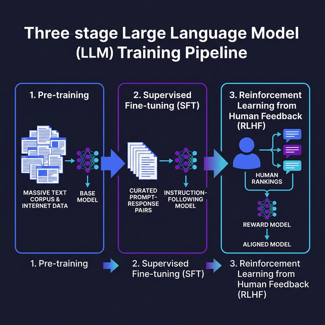

# Pre-training vs Fine-tuning

> Understand how base models are created and then refined to follow instructions, and where RLHF fits into the picture.

## Introduction

When people say "GPT-4" or "Claude," they're usually talking about a model that went through _multiple_ training stages. Understanding these stages explains why models behave differently depending on their variant — why a "base" model just completes text while an "instruct" model answers questions helpfully.

The training pipeline has broadly three phases: **pre-training** (learning language from the internet), **supervised fine-tuning** (learning to follow instructions), and **RLHF** (learning to be helpful, harmless, and honest). As a developer using APIs, you don't run these stages yourself, but knowing them helps you understand model capabilities and choose the right one.

## Core Concepts

### Pre-training: Learning Language at Scale

During pre-training, the model is fed enormous amounts of text — books, websites, code, scientific papers — and learns to predict the next token. That's it. The entire objective is: given the tokens so far, what comes next?

This simple objective, applied to trillions of tokens over thousands of GPUs, produces a **base model** that has absorbed patterns of language, facts, reasoning structures, and code. But a base model isn't particularly _useful_ on its own — ask it a question and it might continue your text like an autocomplete engine rather than answer you.

```typescript
// What a base model does: next-token prediction
// Input:  "The capital of France is"
// Output: " Paris. It is known for the Eiffel Tower..."
// It just continues the text pattern — useful but not conversational.

// Base model behavior is like autocomplete:
const baseModelPrompt = "Write a function that adds two numbers:";
// Base model output might be:
// "Write a function that subtracts two numbers:
//  Write a function that multiplies two numbers:"
// It continues the PATTERN, not the instruction.
```

### Supervised Fine-Tuning (SFT): Teaching Instructions

After pre-training, the model is fine-tuned on curated **(prompt, response)** pairs written by human annotators. This teaches the model to treat the input as an instruction and generate a helpful response rather than just continuing text.

This is where the model learns to:

- Answer questions directly
- Follow formatting instructions ("respond in JSON")
- Refuse harmful requests
- Write code when asked

```typescript
// SFT training data looks like this:
const sftExample = {
  prompt: "Explain what a closure is in JavaScript in 2 sentences.",
  response:
    "A closure is a function that retains access to variables from its " +
    "enclosing scope even after that outer function has returned. This " +
    "lets you create private state and factory functions in JavaScript.",
};

// After SFT, the same base model that just autocompleted
// now actually follows instructions.
```

### RLHF: Reinforcement Learning from Human Feedback

RLHF is the final polish. Human evaluators rank multiple model responses to the same prompt from best to worst. A **reward model** is trained on these rankings, and then the LLM is fine-tuned using reinforcement learning to maximize the reward model's score.

This stage is where models learn _nuance_: being more helpful in tone, structuring answers clearly, admitting uncertainty instead of hallucinating, and balancing helpfulness with safety.

```typescript
// Conceptual RLHF pipeline:
const pipeline = {
  step1_generate: "Model produces multiple responses to a prompt",
  step2_rank: "Humans rank: Response A > Response C > Response B",
  step3_reward: "Reward model learns to predict human rankings",
  step4_optimize: "LLM is tuned to produce higher-reward responses",
};

// The result: the model becomes noticeably more "polished"
// in tone, accuracy, and formatting compared to SFT alone.
```

### Instruction Tuning vs Chat Tuning

You'll see models labeled "instruct" (e.g., GPT-3.5-turbo-instruct) or "chat" (most modern models). **Instruct models** are fine-tuned for single-turn instructions. **Chat models** are fine-tuned on multi-turn conversations with system/user/assistant roles. For API work, chat models are almost always what you want.

## Visual Aids



## Key Takeaways

- **Pre-training** teaches language patterns from massive text corpora — the resulting base model is a powerful autocomplete engine
- **Supervised fine-tuning** turns the base model into an instruction-follower using curated (prompt, response) pairs
- **RLHF** adds a final layer of alignment, teaching the model to be helpful, harmless, and honest
- **Instruct vs chat** models differ in whether they're tuned for single-turn or multi-turn interactions
- You don't need to train models yourself, but understanding the pipeline helps you predict model behavior and set realistic expectations

## Further Reading

- [Training language models to follow instructions with human feedback — Ouyang et al. 2022](https://arxiv.org/abs/2203.02155)
- [Anthropic — Constitutional AI (RLHF alternative)](https://www.anthropic.com/research/constitutional-ai)
- [Meta — Llama 2 training process](https://arxiv.org/abs/2307.09288)
- [Chip Huyen — RLHF explained](https://huyenchip.com/2023/05/02/rlhf.html)

---

## 🧭 Navigation

### Continue Reading

- ⬅️ Previous: [Transformer Architecture](02-transformer-architecture.md)
- ➡️ Next: [Context Windows & Memory](04-context-windows-and-memory.md)
- 📚 [Back to Block Index](index.md)
