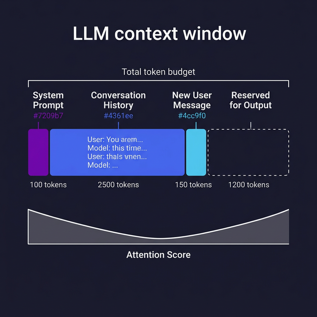

# Context Windows & Memory

> Learn how LLMs handle limited memory, why token limits matter, and strategies for working within them.

## Introduction

LLMs don't have memory the way humans do. They don't remember your last conversation or learn from previous interactions. Every time you make an API call, the model sees only what's in the **context window** — the combined system prompt, conversation history, and your new message, all measured in tokens.

This has huge practical implications. If your context window is 128K tokens, you _can_ stuff a small novel into it, but bigger contexts cost more, take longer to process, and models tend to pay less attention to the middle (a phenomenon known as "lost in the middle"). Understanding context windows is essential for building reliable AI-powered applications.

## Core Concepts

### Token Limits

Every model has a maximum context length. This is the total number of tokens for **input + output combined**:

| Model             | Max Context | Approximate Pages |
| ----------------- | ----------- | ----------------- |
| GPT-4o            | 128K tokens | ~300 pages        |
| Claude 3.5 Sonnet | 200K tokens | ~500 pages        |
| Gemini 1.5 Pro    | 2M tokens   | ~5,000 pages      |
| Llama 3 (8B)      | 8K tokens   | ~20 pages         |

If your input exceeds the limit, the API will return an error. If input + output would exceed it, the model's response gets cut off.

```typescript
// Always check your token count before sending a request
import { encoding_for_model } from "tiktoken";

function checkContextFit(messages: string[], maxTokens: number): boolean {
  const encoder = encoding_for_model("gpt-4o");
  const totalTokens = messages.reduce((sum, msg) => {
    return sum + encoder.encode(msg).length;
  }, 0);
  encoder.free();

  const reserveForOutput = 1000; // Leave room for the response
  console.log(
    `Using ${totalTokens} of ${maxTokens - reserveForOutput} available tokens`,
  );
  return totalTokens < maxTokens - reserveForOutput;
}
```

### Chunking Strategies

When your data doesn't fit in one context window, you need to **chunk** it — split it into pieces that each fit. The choice of chunking strategy significantly affects quality:

**Fixed-size chunking**: Split every N tokens. Simple but can break mid-sentence.

```typescript
function fixedSizeChunk(
  text: string,
  chunkSize: number,
  overlap: number,
): string[] {
  const words = text.split(" ");
  const chunks: string[] = [];
  for (let i = 0; i < words.length; i += chunkSize - overlap) {
    chunks.push(words.slice(i, i + chunkSize).join(" "));
  }
  return chunks;
}
```

**Recursive chunking**: Split on paragraph boundaries, then sentences, then words. Preserves semantic units better.

**Semantic chunking**: Use embeddings to detect topic shifts. Most expensive but produces the most coherent chunks.

### Context Management in Conversations

In a multi-turn chat application, the conversation history grows with every message. Eventually it won't fit in the context window. Common strategies:

1. **Sliding window**: Drop the oldest messages, keeping only the most recent N turns
2. **Summarization**: Periodically summarize old messages into a compact paragraph
3. **Hybrid**: Keep recent messages verbatim and summarize older ones

```typescript
// Simple sliding window context management
interface Message {
  role: "system" | "user" | "assistant";
  content: string;
}

function trimConversation(
  messages: Message[],
  maxTokens: number,
  systemPrompt: Message,
): Message[] {
  // Always keep the system prompt
  const result: Message[] = [systemPrompt];
  let tokenCount = estimateTokens(systemPrompt.content);

  // Add messages from most recent, working backwards
  for (let i = messages.length - 1; i >= 0; i--) {
    const msgTokens = estimateTokens(messages[i].content);
    if (tokenCount + msgTokens > maxTokens) break;
    result.splice(1, 0, messages[i]); // Insert after system prompt
    tokenCount += msgTokens;
  }
  return result;
}
```

### The "Lost in the Middle" Problem

Research has shown that LLMs pay the most attention to tokens at the **beginning** and **end** of the context, while information buried in the middle gets less attention. This means the order in which you present information matters — put the most important content at the beginning or end of your prompt.

## Visual Aids



## Key Takeaways

- The **context window** is the model's entire "working memory" — it can only see what you send in each request
- **Token limits** vary by model from 8K to 2M+ but bigger isn't always better (cost and attention degrade)
- **Chunking** is essential for processing documents that exceed the context window
- In chat apps, use a **sliding window** or **summarization** strategy to manage growing conversation history
- Put important information at the **beginning or end** of your context, not buried in the middle

## Further Reading

- [Lost in the Middle — Liu et al. 2023](https://arxiv.org/abs/2307.03172)
- [Anthropic — Long context prompting tips](https://docs.anthropic.com/en/docs/build-with-claude/prompt-engineering/long-context-tips)
- [OpenAI — Managing tokens](https://platform.openai.com/docs/guides/rate-limits/managing-tokens)
- [LangChain — Text splitters](https://js.langchain.com/docs/how_to/#text-splitters)

---

## 🧭 Navigation

### Practice This

- 🏋️ [Exercise: Build a Context Window Manager](../../exercises/block-00/ex-03-context-window/)

### Continue Reading

- ⬅️ Previous: [Pre-training vs Fine-tuning](03-pre-training-vs-fine-tuning.md)
- ➡️ Next: [Inference Parameters](05-inference-parameters.md)
- 📚 [Back to Block Index](index.md)
