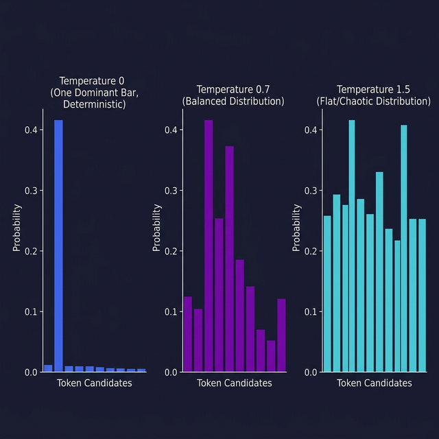

# Inference Parameters

> Learn how to control LLM output by tuning temperature, top-p, frequency penalty, and stop sequences.

## Introduction

When you call an LLM API, you don't just send a prompt — you also send **parameters** that control _how_ the model generates its response. These settings determine whether the output is creative or deterministic, verbose or concise, repetitive or varied.

Getting these right is the difference between a model that gives you consistent JSON every time and one that goes on creative tangents. Most developers leave them at defaults, but understanding what each knob does gives you precise control over model behavior.

## Core Concepts

### Temperature

**Temperature** controls the randomness of the output. It works by scaling the probability distribution over the next token before sampling:

- **temperature = 0**: Greedy decoding — the model always picks the highest-probability token. Output is deterministic and repetitive.
- **temperature = 0.7**: Balanced — the model is mostly predictable but can surprise you.
- **temperature = 1.0**: Full distribution — the model samples naturally, producing creative and varied outputs.
- **temperature > 1.0**: Increasingly chaotic — useful for brainstorming, risky for anything structured.

```typescript
import OpenAI from "openai";

const openai = new OpenAI();

// Deterministic: always the same answer
const precise = await openai.chat.completions.create({
  model: "gpt-4o",
  temperature: 0,
  messages: [{ role: "user", content: "What is 2 + 2?" }],
});

// Creative: varied responses each time
const creative = await openai.chat.completions.create({
  model: "gpt-4o",
  temperature: 1.2,
  messages: [{ role: "user", content: "Write a tagline for a coffee shop" }],
});
```

**Rule of thumb**: Use `temperature: 0` for code generation, data extraction, and classification. Use `0.7–1.0` for creative writing, brainstorming, and conversational responses.

### Top-p (Nucleus Sampling)

**Top-p** (also called _nucleus_ sampling) is an alternative to temperature. Instead of scaling all probabilities, it keeps only the smallest set of tokens whose cumulative probability exceeds `p`, then samples from that set.

- **top_p = 0.1**: Only the most likely tokens are considered — very focused output
- **top_p = 0.9**: Most tokens are in play — varied but reasonable output
- **top_p = 1.0**: All tokens considered (equivalent to no filtering)

```typescript
// Top-p sampling: only consider the top 10% probability mass
const focused = await openai.chat.completions.create({
  model: "gpt-4o",
  top_p: 0.1,
  messages: [{ role: "user", content: "Translate 'hello' to French" }],
});
```

> **Important**: OpenAI recommends adjusting either `temperature` OR `top_p`, not both at the same time. They interact in complex ways, and tuning both often produces unexpected results.

### Frequency and Presence Penalties

These parameters reduce repetition:

- **frequency_penalty** (0 to 2): Penalizes tokens based on how many times they've already appeared. Higher values = less repetition of specific words.
- **presence_penalty** (0 to 2): Penalizes tokens that have appeared _at all_ (regardless of count). Encourages the model to introduce new topics.

```typescript
// Reduce repetitive outputs
const diverse = await openai.chat.completions.create({
  model: "gpt-4o",
  frequency_penalty: 0.5, // Discourage repeating the same phrases
  presence_penalty: 0.3, // Encourage exploring new topics
  messages: [
    {
      role: "user",
      content: "List 10 unique startup ideas in different industries",
    },
  ],
});
```

### Stop Sequences

**Stop sequences** tell the model when to stop generating. When the model produces a stop sequence, it immediately stops and returns the response _without_ the stop sequence. This is useful for controlling output format:

```typescript
// Stop generation at specific markers
const structured = await openai.chat.completions.create({
  model: "gpt-4o",
  stop: ["\n\n", "END"],
  messages: [
    {
      role: "user",
      content: "Give me a one-line definition of 'API':",
    },
  ],
});

// The model will stop as soon as it produces a double newline or "END"
// This prevents it from rambling past the answer
```

### Max Tokens

**max_tokens** sets an upper limit on the length of the generated response. It doesn't make the response longer — it just caps it. If the model would have generated 500 tokens but you set `max_tokens: 100`, you get a truncated response.

````typescript
// A practical parameter combination for structured output
const extraction = await openai.chat.completions.create({
  model: "gpt-4o",
  temperature: 0, // Deterministic
  max_tokens: 200, // Cap response length
  stop: ["```"], // Stop after code block
  messages: [
    {
      role: "user",
      content: "Extract the email addresses from this text: ...",
    },
  ],
});
````

## Visual Aids



## Key Takeaways

- **Temperature** controls randomness: 0 = deterministic, 1+ = creative
- **Top-p** filters tokens by cumulative probability — use it OR temperature, not both
- **Frequency and presence penalties** fight repetition: frequency targets repeated words, presence encourages new topics
- **Stop sequences** let you precisely control where the model stops generating
- For structured outputs (JSON, code), use low temperature and explicit stop sequences

## Further Reading

- [OpenAI API — Parameters reference](https://platform.openai.com/docs/api-reference/chat/create)
- [Anthropic — Sampling parameters](https://docs.anthropic.com/en/docs/test-and-evaluate/strengthen-guardrails/increase-consistency)
- [How to sample from language models — Hugging Face](https://huggingface.co/blog/how-to-generate)
