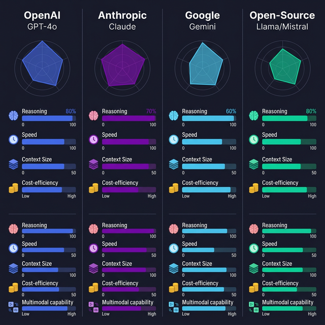

import Quiz from '@site/src/components/Quiz';

# Model Landscape

> Navigate the current LLM ecosystem — which models exist, what they're good at, and how to choose.

## Introduction

The LLM landscape evolves fast. New models drop almost weekly, benchmarks shift, and pricing changes constantly. Rather than memorizing specs that'll be outdated next month, this topic gives you a framework for _evaluating_ models and understanding the key players as of today.

As a developer, you'll likely work with two or three model providers. The goal is knowing enough to pick the right model for the task without overthinking it — and knowing when to switch.

## Core Concepts

### OpenAI — GPT Family

OpenAI's GPT models are the most widely used in production. The current lineup:

| Model       | Strengths                          | Best For                          |
| ----------- | ---------------------------------- | --------------------------------- |
| GPT-4o      | Strong reasoning, multimodal       | Complex tasks, code, analysis     |
| GPT-4o-mini | Fast, cheap, surprisingly capable  | High-volume tasks, simple queries |
| o1 / o3     | Deep reasoning ("thinking" models) | Math, logic, complex planning     |

```typescript
import OpenAI from "openai";

const openai = new OpenAI();

// Use GPT-4o for complex tasks
const analysis = await openai.chat.completions.create({
  model: "gpt-4o",
  messages: [
    { role: "user", content: "Review this code for security issues: ..." },
  ],
});

// Use GPT-4o-mini for simple tasks (10-20x cheaper)
const classification = await openai.chat.completions.create({
  model: "gpt-4o-mini",
  messages: [{ role: "user", content: "Classify this support ticket: ..." }],
});
```

### Anthropic — Claude Family

Anthropic's Claude models are known for strong instruction following, large context windows, and careful safety behavior:

| Model             | Strengths                         | Best For                          |
| ----------------- | --------------------------------- | --------------------------------- |
| Claude 3.5 Sonnet | Best balance of speed/quality     | General-purpose, coding, analysis |
| Claude 3.5 Haiku  | Fastest, cheapest Anthropic model | High-volume, real-time use cases  |
| Claude 3 Opus     | Deepest reasoning                 | Complex research, nuanced writing |

Claude's standout feature is its 200K token context window (available across all models), plus excellent performance on long-document tasks.

```typescript
import Anthropic from "@anthropic-ai/sdk";

const anthropic = new Anthropic();

const response = await anthropic.messages.create({
  model: "claude-sonnet-4-20250514",
  max_tokens: 1024,
  messages: [{ role: "user", content: "Summarize this 50-page document: ..." }],
});
```

### Google — Gemini Family

Google's Gemini models offer competitive performance with massive context windows:

| Model            | Strengths                    | Best For                         |
| ---------------- | ---------------------------- | -------------------------------- |
| Gemini 1.5 Pro   | 2M token context, multimodal | Long documents, video analysis   |
| Gemini 1.5 Flash | Fast, free tier available    | Prototyping, cost-sensitive apps |

Gemini's edge is the enormous context window (2M tokens) and strong multimodal capabilities (text, images, video, audio in a single request).

### Open-Source Models

Open-source models run on your own hardware (or rented GPUs), giving you full control and zero per-token cost:

| Model             | Parameters | Strengths                           |
| ----------------- | ---------- | ----------------------------------- |
| Llama 3 (Meta)    | 8B, 70B    | Best open-source all-rounder        |
| Mistral / Mixtral | 7B, 8x7B   | Excellent efficiency, European-made |
| Qwen 2.5          | 7B, 72B    | Strong multilingual, coding         |

Running them locally with **Ollama** or **LM Studio** is straightforward:

```bash
# Install Ollama and pull a model
ollama pull llama3
ollama run llama3 "Explain closures in JavaScript"
```

```typescript
// Ollama exposes an OpenAI-compatible API on localhost
import OpenAI from "openai";

const local = new OpenAI({
  baseURL: "http://localhost:11434/v1",
  apiKey: "ollama", // Required but unused
});

const response = await local.chat.completions.create({
  model: "llama3",
  messages: [{ role: "user", content: "Hello!" }],
});
```

### How to Choose a Model

Use this decision framework:

1. **Complexity**: Does the task require deep reasoning? → GPT-4o, Claude Opus, o1
2. **Volume**: Are you making thousands of calls? → GPT-4o-mini, Claude Haiku, Gemini Flash
3. **Context size**: Do you need to process huge documents? → Gemini 1.5 Pro, Claude models
4. **Privacy**: Must data stay on your servers? → Open-source via Ollama
5. **Cost**: Is budget tight? → Open-source, or GPT-4o-mini / Gemini Flash
6. **Multimodal**: Do you need image/video input? → GPT-4o, Gemini, Claude Sonnet

## Visual Aids



## Key Takeaways

- **GPT-4o** is the general-purpose workhorse; **GPT-4o-mini** is the cheap fast option
- **Claude 3.5 Sonnet** excels at instruction following and long documents
- **Gemini 1.5 Pro** offers the largest context window (2M tokens)
- **Open-source models** (Llama, Mistral) are viable for privacy-sensitive or cost-sensitive applications
- Don't lock yourself into one provider — most APIs are similar enough to swap models with minimal code changes
- The landscape changes fast: benchmark against your actual use case, not leaderboard scores

## Further Reading

- [OpenAI Models overview](https://platform.openai.com/docs/models)
- [Anthropic Model comparison](https://docs.anthropic.com/en/docs/about-claude/models)
- [Google AI — Gemini](https://ai.google.dev/gemini-api/docs)
- [Ollama — Run open-source models locally](https://ollama.ai)
- [Chatbot Arena Leaderboard — LMSYS](https://chat.lmsys.org/?leaderboard)

## Knowledge Check

<Quiz 
  questions={[
    {
      text: "Which of the following OpenAI models is generally recommended as the fast, cheap option for high-volume or simpler tasks?",
      options: [
        "GPT-4o",
        "o1",
        "GPT-4o-mini",
        "GPT-3"
      ],
      correctAnswerIndex: 2,
      explanation: "GPT-4o-mini is positioned as a highly capable but significantly faster and cheaper alternative (typically 10-20x cheaper) for simpler or high-volume API requests compared to the flagship model."
    },
    {
      text: "What is a standout feature of Anthropic's Claude 3.5 Sonnet that makes it particularly useful for analyzing large documents?",
      options: [
        "Its ability to run entirely offline on a smartphone.",
        "Its massive 200K token context window.",
        "Its built-in web scraping tool.",
        "Its focus exclusively on medical and legal terminology."
      ],
      correctAnswerIndex: 1,
      explanation: "The Claude models currently feature a 200K token context window across the board, making them excellent choices for tasks involving long documents or large codebases."
    },
    {
      text: "Which of the following models natively offers an enormous 2 million token context window?",
      options: [
        "Gemini 1.5 Pro",
        "Llama 3 (70B)",
        "GPT-4o",
        "Claude 3 Opus"
      ],
      correctAnswerIndex: 0,
      explanation: "Google's Gemini 1.5 Pro sets itself apart with an industry-leading 2 million token context window, allowing for massive data ingestion like entire codebases or long videos."
    },
    {
      text: "What is a primary advantage of using open-source models like Llama 3 or Mistral over proprietary APIs?",
      options: [
        "They are guaranteed to be smarter than any proprietary model.",
        "They allow for data privacy since they run on your own hardware, with zero per-token cost.",
        "They have infinite context windows.",
        "They automatically update themselves every week without any manual intervention."
      ],
      correctAnswerIndex: 1,
      explanation: "Open-source models can be hosted locally or on rented GPUs, giving developers full control over their data (crucial for absolute privacy) and eliminating variable per-token API costs."
    },
    {
      text: "When a task requires deep, complex reasoning (like advanced math or complex planning), which model family member is specifically designed as a 'thinking' model?",
      options: [
        "Gemini 1.5 Flash",
        "GPT-4o-mini",
        "Llama 3 (8B)",
        "OpenAI's o1 / o3"
      ],
      correctAnswerIndex: 3,
      explanation: "OpenAI's o-series models (like o1 and o3) are specifically engineered for deep reasoning, taking more time to 'think' through complex logic and math problems before producing an answer."
    }
  ]}
/>

