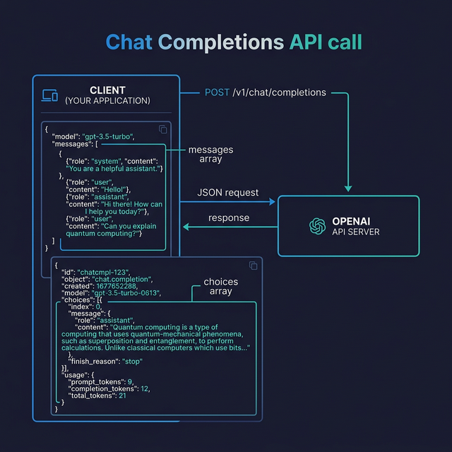

# OpenAI API

import InteractiveExercise from '@site/src/components/InteractiveExercise';

> Learn how to call OpenAI's Chat Completions API from TypeScript, handle responses, and use function calling.

## Introduction

The OpenAI API is the gateway to models like GPT-4o and GPT-4o-mini. Whether you're building a chatbot, a code assistant, or an automated writing tool, the Chat Completions endpoint is the workhorse you'll use. Think of it as a structured conversation: you send an array of messages (with roles like `system`, `user`, and `assistant`) and the model replies with its best continuation.

Understanding this API well means you stop treating the model as a magic box and start shaping its behavior intentionally — choosing roles, tuning parameters, and even letting it call your functions.

## Core Concepts

### Installing the SDK

OpenAI provides an official TypeScript/JavaScript SDK. Install it and set up your API key:

```typescript
// npm install openai
import OpenAI from "openai";

const openai = new OpenAI({
  apiKey: process.env.OPENAI_API_KEY, // never hardcode keys
});
```

The SDK reads `OPENAI_API_KEY` from the environment automatically, but being explicit makes your code clearer and helps teammates understand the dependency.

### Chat Completions

The **Chat Completions API** (`/v1/chat/completions`) is the core endpoint. You send an array of messages and receive a model-generated reply:

```typescript
const response = await openai.chat.completions.create({
  model: "gpt-4o",
  messages: [
    { role: "system", content: "You are a helpful coding assistant." },
    { role: "user", content: "Explain closures in JavaScript in 3 sentences." },
  ],
  temperature: 0.7,
  max_tokens: 200,
});

const reply = response.choices[0].message.content;
console.log(reply);
```

The **message roles** matter:
- `system` — sets the persona and rules (processed first, shapes all replies)
- `user` — the human's messages
- `assistant` — previous model replies (used for multi-turn conversations)

### Multi-turn Conversations

To maintain context across turns, you accumulate messages in an array:

```typescript
const messages: OpenAI.ChatCompletionMessageParam[] = [
  { role: "system", content: "You are a concise TypeScript tutor." },
];

async function chat(userMessage: string): Promise<string> {
  messages.push({ role: "user", content: userMessage });

  const response = await openai.chat.completions.create({
    model: "gpt-4o",
    messages,
  });

  const reply = response.choices[0].message;
  messages.push(reply); // add assistant reply to history

  return reply.content ?? "";
}
```

Keep in mind that every message in the array counts toward the model's context window. As conversations grow, you'll need strategies from Block 0 (chunking, summarization) to keep within token limits.

### Function Calling

One of OpenAI's most powerful features is **function calling** — the model can decide to invoke functions you define, returning structured JSON instead of free-form text:

```typescript
const response = await openai.chat.completions.create({
  model: "gpt-4o",
  messages: [{ role: "user", content: "What's the weather in Madrid?" }],
  tools: [
    {
      type: "function",
      function: {
        name: "get_weather",
        description: "Get current weather for a city",
        parameters: {
          type: "object",
          properties: {
            city: { type: "string", description: "The city name" },
            units: {
              type: "string",
              enum: ["celsius", "fahrenheit"],
              description: "Temperature units",
            },
          },
          required: ["city"],
        },
      },
    },
  ],
});

const toolCall = response.choices[0].message.tool_calls?.[0];
if (toolCall) {
  const args = JSON.parse(toolCall.function.arguments);
  console.log(`Call ${toolCall.function.name} with`, args);
  // { city: "Madrid", units: "celsius" }
}
```

The model doesn't execute the function — it tells you _which_ function to call and _with what arguments_. You run the function, then send the result back in a follow-up message. We'll explore this in depth in Block 4.

## Visual Aids



## Key Takeaways

- The **Chat Completions API** is message-based: you send an array of `system`, `user`, and `assistant` messages
- The SDK reads `OPENAI_API_KEY` from the environment — never hardcode secrets
- **Multi-turn conversations** accumulate messages, but watch token limits
- **Function calling** lets the model return structured JSON to invoke your functions
- Always extract `response.choices[0].message` — that's where the content lives

## Further Reading

- [OpenAI API Reference — Chat Completions](https://platform.openai.com/docs/api-reference/chat)
- [OpenAI Function Calling Guide](https://platform.openai.com/docs/guides/function-calling)
- [OpenAI SDK for TypeScript/JavaScript](https://github.com/openai/openai-node)
- [OpenAI Cookbook](https://cookbook.openai.com/)

---

## 🧭 Navigation

### Practice This

#### Build a Chat Completions Client
<InteractiveExercise block="block-01" exercise="ex-01-chat-completions" />

- 🔧 [Tool: api-tester.ts](pathname:///tools/api-tester.ts)

### Continue Reading

- ➡️ Next: [Anthropic API](02-anthropic-api.md)
- 📚 [Back to Block Index](README.md)
