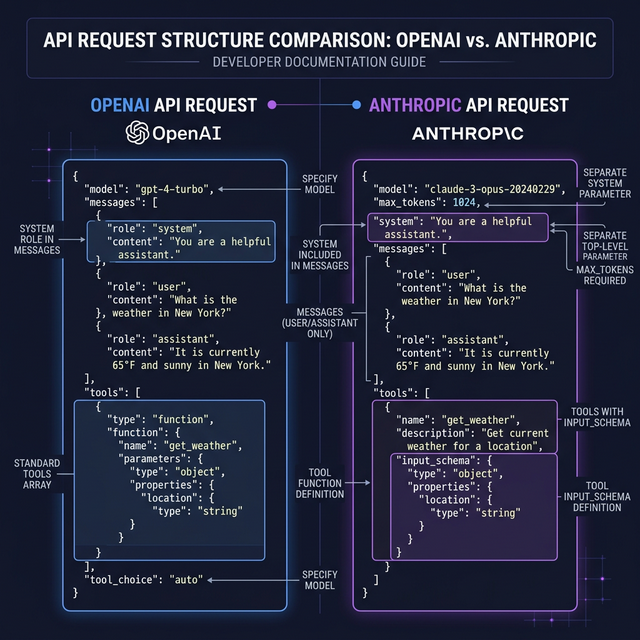

# Anthropic API

> Learn how to interact with Claude models via the Anthropic Messages API, shape behavior with system prompts, and use tool calling.

## Introduction

Anthropic's Claude models (Claude 3.5 Sonnet, Claude 3.5 Haiku, etc.) offer a different flavor of LLM interaction. While the core idea is the same — send messages, get replies — the API design has some meaningful differences from OpenAI. Anthropic separates the system prompt from messages, uses a slightly different tool-calling pattern, and has its own SDK conventions.

Understanding both APIs makes you API-agnostic: you can pick the best model for each task without being locked into a single provider. Think of it like knowing both PostgreSQL and MySQL — the concepts transfer, but the syntax matters when shipping code.

## Core Concepts

### Installing the SDK

Anthropic provides an official TypeScript SDK:

```typescript
// npm install @anthropic-ai/sdk
import Anthropic from "@anthropic-ai/sdk";

const anthropic = new Anthropic({
  apiKey: process.env.ANTHROPIC_API_KEY,
});
```

### The Messages API

Anthropic's core endpoint is the **Messages API**. Unlike OpenAI, the `system` prompt is a top-level parameter, not a message in the array:

```typescript
const response = await anthropic.messages.create({
  model: "claude-sonnet-4-20250514",
  max_tokens: 1024,
  system: "You are a helpful coding assistant specialized in TypeScript.",
  messages: [
    { role: "user", content: "Explain the difference between type and interface." },
  ],
});

// Response structure differs from OpenAI
const reply = response.content[0]; // ContentBlock
if (reply.type === "text") {
  console.log(reply.text);
}
```

Key differences from OpenAI:
- `system` is a **separate parameter**, not a message with `role: "system"`
- `max_tokens` is **required** (OpenAI defaults it)
- The response uses `content` (array of content blocks), not `choices`

### System Prompts in Depth

Anthropic's system prompt separation reflects their design philosophy — it's a first-class instruction set, not just the first message. This makes it particularly effective for:

```typescript
const response = await anthropic.messages.create({
  model: "claude-sonnet-4-20250514",
  max_tokens: 1024,
  system: `You are a senior TypeScript code reviewer.
Rules:
- Only point out actual bugs, not style preferences
- Rate severity: low / medium / high / critical
- Always suggest a fix, never just complain
- Respond in JSON format: { "issues": [{ "severity", "line", "description", "fix" }] }`,
  messages: [
    { role: "user", content: "Review this code:\n\n```typescript\nconst data = fetch('/api');\nconsole.log(data.json());\n```" },
  ],
});
```

### Multi-turn Conversations

Like OpenAI, you accumulate messages for multi-turn chats. Anthropic enforces strict **alternating roles** — `user` and `assistant` must alternate:

```typescript
const messages: Anthropic.MessageParam[] = [];

async function chat(userMessage: string): Promise<string> {
  messages.push({ role: "user", content: userMessage });

  const response = await anthropic.messages.create({
    model: "claude-sonnet-4-20250514",
    max_tokens: 1024,
    system: "You are a concise TypeScript tutor.",
    messages,
  });

  const text = response.content
    .filter((block) => block.type === "text")
    .map((block) => block.text)
    .join("");

  messages.push({ role: "assistant", content: text });
  return text;
}
```

### Tool Use

Anthropic calls function calling **"tool use"**. The concept is the same — you define tools, the model decides when to call them — but the API shape differs:

```typescript
const response = await anthropic.messages.create({
  model: "claude-sonnet-4-20250514",
  max_tokens: 1024,
  messages: [{ role: "user", content: "What's the weather in Barcelona?" }],
  tools: [
    {
      name: "get_weather",
      description: "Get current weather for a city",
      input_schema: {
        type: "object",
        properties: {
          city: { type: "string", description: "The city name" },
          units: {
            type: "string",
            enum: ["celsius", "fahrenheit"],
            description: "Temperature units",
          },
        },
        required: ["city"],
      },
    },
  ],
});

// Check for tool use in response
for (const block of response.content) {
  if (block.type === "tool_use") {
    console.log(`Call ${block.name} with`, block.input);
    // { city: "Barcelona", units: "celsius" }
  }
}
```

Notice: Anthropic uses `input_schema` (not `parameters`), and tool calls come as content blocks with `type: "tool_use"` (not a separate `tool_calls` array).

## Visual Aids



## Key Takeaways

- Anthropic's **Messages API** separates the `system` prompt from the message array
- `max_tokens` is **required** — there's no default
- Responses use `content[]` blocks instead of `choices[]`
- **Tool use** follows the same pattern as OpenAI's function calling but with different field names
- Multi-turn conversations **must alternate** between `user` and `assistant` roles
- Learning both APIs makes you provider-agnostic and lets you pick the best model per task

## Further Reading

- [Anthropic API Reference — Messages](https://docs.anthropic.com/en/api/messages)
- [Anthropic Tool Use Guide](https://docs.anthropic.com/en/docs/build-with-claude/tool-use)
- [Anthropic SDK for TypeScript](https://github.com/anthropics/anthropic-sdk-typescript)
- [Claude Model Comparison](https://docs.anthropic.com/en/docs/about-claude/models)

