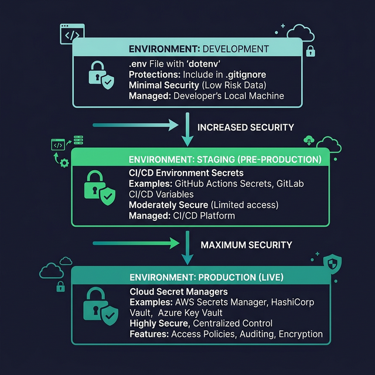

# Authentication & Key Management

> Learn how to securely manage API keys for LLM providers using environment variables, `.env` files, and secret rotation practices.

## Introduction

API keys are the passwords to your AI services. Leak one and someone else racks up charges on your account — or worse, accesses sensitive data flowing through your prompts. This isn't a theoretical risk: leaked OpenAI keys regularly show up on GitHub and get drained within minutes by automated scanners.

Good key management is boring but essential. It's the difference between a weekend project that costs you $500 because a key leaked and a production system that stays secure. Fortunately, the patterns are straightforward once you know them.

## Core Concepts

### Environment Variables

The golden rule: **API keys live in environment variables, never in source code**. Both the OpenAI and Anthropic SDKs read from environment variables by default:

```typescript
// Both SDKs auto-read from env if you don't pass apiKey
import OpenAI from "openai";
import Anthropic from "@anthropic-ai/sdk";

// These read OPENAI_API_KEY and ANTHROPIC_API_KEY respectively
const openai = new OpenAI();
const anthropic = new Anthropic();
```

Set them in your shell before running your code:

```bash
export OPENAI_API_KEY="sk-proj-..."
export ANTHROPIC_API_KEY="sk-ant-..."
```

### The `.env` File Pattern

For local development, manually exporting vars gets old fast. The **dotenv** pattern uses a `.env` file in your project root:

```bash
# .env — NEVER commit this file
OPENAI_API_KEY=sk-proj-abc123...
ANTHROPIC_API_KEY=sk-ant-xyz789...
```

Load it at the very start of your application:

```typescript
// npm install dotenv
import "dotenv/config"; // loads .env into process.env

import OpenAI from "openai";
const openai = new OpenAI(); // reads OPENAI_API_KEY from process.env
```

**Critical**: add `.env` to your `.gitignore` immediately. Better yet, commit a `.env.example` with placeholder values so collaborators know which variables are needed:

```bash
# .env.example — safe to commit
OPENAI_API_KEY=sk-proj-your-key-here
ANTHROPIC_API_KEY=sk-ant-your-key-here
```

### Key Validation at Startup

Don't wait until the first API call fails to discover a missing key. Validate at startup:

```typescript
function validateConfig(): { openaiKey: string; anthropicKey: string } {
  const openaiKey = process.env.OPENAI_API_KEY;
  const anthropicKey = process.env.ANTHROPIC_API_KEY;

  const missing: string[] = [];
  if (!openaiKey) missing.push("OPENAI_API_KEY");
  if (!anthropicKey) missing.push("ANTHROPIC_API_KEY");

  if (missing.length > 0) {
    console.error(`Missing environment variables: ${missing.join(", ")}`);
    console.error("Copy .env.example to .env and fill in your keys.");
    process.exit(1);
  }

  return { openaiKey, anthropicKey };
}
```

### Secret Rotation

API keys should be rotated periodically and immediately if you suspect a leak:

1. **Generate a new key** in your provider's dashboard
2. **Update** all environments (local `.env`, CI/CD secrets, production env vars)
3. **Revoke the old key** — don't just leave it active as a "backup"
4. **Verify** your application still works with the new key

Most providers let you have multiple active keys simultaneously, which makes zero-downtime rotation possible: deploy with the new key first, then revoke the old one.

### Production Best Practices

In production, `.env` files aren't enough. Use proper secrets management:

```typescript
// Different approaches by deployment target

// Vercel / Netlify: set env vars in dashboard, they're injected at build/runtime

// Docker: pass via --env-file or orchestrator secrets
// docker run --env-file .env.production my-app

// Node.js with runtime secrets (e.g., AWS Secrets Manager)
import { SecretsManager } from "@aws-sdk/client-secrets-manager";

async function getApiKey(secretName: string): Promise<string> {
  const client = new SecretsManager({ region: "us-east-1" });
  const result = await client.getSecretValue({ SecretId: secretName });
  return result.SecretString ?? "";
}
```

## Visual Aids



## Key Takeaways

- **Never hardcode API keys** — always use environment variables
- Use `.env` files for local development, but **never commit them** to version control
- **Validate keys at startup** — fail fast with clear error messages
- **Rotate keys** periodically and immediately after any suspected leak
- In production, use **secrets managers** (AWS Secrets Manager, Vault, platform env vars) instead of files

## Further Reading

- [OpenAI API Key Best Practices](https://platform.openai.com/docs/api-reference/authentication)
- [dotenv on npm](https://www.npmjs.com/package/dotenv)
- [12-Factor App — Config](https://12factor.net/config)
- [GitHub Secret Scanning](https://docs.github.com/en/code-security/secret-scanning)

---

## 🧭 Navigation

### Practice This

- 🏋️ [Exercise: Validate API Configuration](../../exercises/block-01/ex-03-config-validator/)

### Continue Reading

- ⬅️ Previous: [Anthropic API](02-anthropic-api.md)
- ➡️ Next: [Token Counting & Pricing](04-token-counting-and-pricing.md)
- 📚 [Back to Block Index](index.md)
