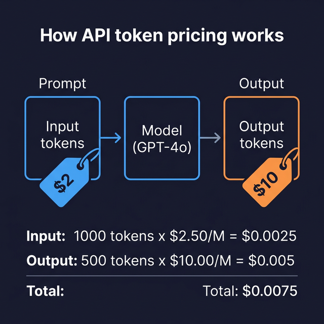

# Token Counting & Pricing

> Learn how to count tokens before calling APIs and estimate costs to keep your AI spending predictable.

## Introduction

Every API call to an LLM costs money, and the bill is measured in **tokens** — the same tokens you learned about in Block 0. The tricky part is that you pay for both the tokens you _send_ (input/prompt tokens) and the tokens the model _generates_ (output/completion tokens), and these often have different prices.

Estimating costs _before_ making a call lets you build features like "this will cost approximately $0.03 — proceed?" or simply catch runaway costs before they hit your billing dashboard. Think of it like checking a restaurant menu before ordering — you want to know what you're signing up for.

## Core Concepts

### How Pricing Works

LLM APIs charge per token, usually quoted as a **price per million tokens** (or per thousand for older references). Input and output tokens have different rates:

```typescript
// Pricing table (as of early 2025 — always check current prices)
const PRICING = {
  "gpt-4o": { inputPerMillion: 2.50, outputPerMillion: 10.00 },
  "gpt-4o-mini": { inputPerMillion: 0.15, outputPerMillion: 0.60 },
  "claude-3.5-sonnet": { inputPerMillion: 3.00, outputPerMillion: 15.00 },
  "claude-3.5-haiku": { inputPerMillion: 0.80, outputPerMillion: 4.00 },
};

function estimateCost(
  inputTokens: number,
  outputTokens: number,
  model: keyof typeof PRICING,
): number {
  const price = PRICING[model];
  const inputCost = (inputTokens / 1_000_000) * price.inputPerMillion;
  const outputCost = (outputTokens / 1_000_000) * price.outputPerMillion;
  return inputCost + outputCost;
}
```

### Counting Tokens with tiktoken

OpenAI's **tiktoken** library gives you exact token counts for OpenAI models. It's the same tokenizer the API uses internally:

```typescript
// npm install tiktoken
import { encoding_for_model } from "tiktoken";

function countTokens(text: string, model: string = "gpt-4o"): number {
  const encoder = encoding_for_model(model as Parameters<typeof encoding_for_model>[0]);
  const tokens = encoder.encode(text);
  const count = tokens.length;
  encoder.free(); // Clean up WASM resources
  return count;
}

const prompt = "Explain the difference between REST and GraphQL.";
console.log(`Tokens: ${countTokens(prompt)}`); // e.g., 9
```

**Important**: `tiktoken` uses WebAssembly, so you must call `encoder.free()` to avoid memory leaks. In production, consider reusing a single encoder instance.

### Counting Message Tokens

A common gotcha: the token count for a chat completion isn't just the text of your messages. Each message has overhead for role markers and formatting:

```typescript
import { encoding_for_model } from "tiktoken";

interface Message {
  role: string;
  content: string;
}

function countMessageTokens(messages: Message[], model: string = "gpt-4o"): number {
  const encoder = encoding_for_model(model as Parameters<typeof encoding_for_model>[0]);
  let totalTokens = 0;

  for (const message of messages) {
    totalTokens += 4; // overhead per message: <|role|>, content, \n, etc.
    totalTokens += encoder.encode(message.role).length;
    totalTokens += encoder.encode(message.content).length;
  }
  totalTokens += 2; // every reply is primed with <|start|>assistant<|message|>

  encoder.free();
  return totalTokens;
}
```

### Quick Estimation without tiktoken

When you don't need exact counts, a quick estimation works:

```typescript
function quickEstimate(text: string): number {
  // Rule of thumb: ~4 characters per token for English
  return Math.ceil(text.length / 4);
}

function wordBasedEstimate(text: string): number {
  // Alternative: ~1.33 tokens per word
  const words = text.split(/\s+/).filter((w) => w.length > 0);
  return Math.ceil(words.length * 1.33);
}
```

These estimates are ballpark — fine for cost alerts, not for hard budgets.

### Reading Usage from API Responses

Both OpenAI and Anthropic return actual token usage in their responses:

```typescript
// OpenAI
const response = await openai.chat.completions.create({ /* ... */ });
console.log(response.usage);
// { prompt_tokens: 25, completion_tokens: 143, total_tokens: 168 }

// Anthropic
const response = await anthropic.messages.create({ /* ... */ });
console.log(response.usage);
// { input_tokens: 20, output_tokens: 130 }
```

Track these after each call to build your own cost monitoring — don't rely solely on the provider's dashboard.

## Visual Aids



## Key Takeaways

- You pay for **both input and output tokens** — output is usually more expensive
- Use **tiktoken** for exact OpenAI token counts before calling the API
- Each message in a chat has **~4 tokens of overhead** beyond its text content
- Quick estimates (~4 chars/token or ~1.33 tokens/word) work for ballpark budgeting
- Always **read `usage` from API responses** to track actual costs
- Build cost estimation into your app before expensive calls to avoid bill shock

## Further Reading

- [OpenAI Pricing](https://openai.com/pricing)
- [Anthropic Pricing](https://www.anthropic.com/pricing)
- [tiktoken on npm](https://www.npmjs.com/package/tiktoken)
- [OpenAI Tokenizer tool](https://platform.openai.com/tokenizer)

