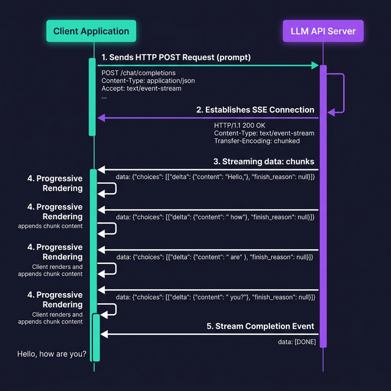

import Quiz from '@site/src/components/Quiz';

# Streaming Responses

> Learn how to stream LLM responses in real time using Server-Sent Events (SSE), giving users instant feedback instead of waiting for complete responses.

## Introduction

When you call an LLM API normally, you wait for the _entire_ response before seeing anything. For a 500-word answer, that might be 5–10 seconds of staring at a loading spinner. **Streaming** changes the game: you get tokens as they're generated, so the first word appears in under a second and the rest flows in smoothly.

This is exactly how ChatGPT and Claude's web interfaces work. That fluid, typewriter-like effect isn't just cosmetic — it fundamentally changes the user experience from "waiting for a response" to "having a conversation." If you're building any user-facing AI feature, streaming is essential.

## Core Concepts

### Server-Sent Events (SSE)

Under the hood, LLM streaming uses **Server-Sent Events** (SSE) — a standard web protocol for one-way, real-time data from server to client. Unlike WebSockets, SSE is simpler: the server sends a stream of `data:` events over a long-lived HTTP connection.

The raw SSE stream from OpenAI looks like this:

```
data: {"id":"chatcmpl-abc","choices":[{"delta":{"content":"Hello"}}]}

data: {"id":"chatcmpl-abc","choices":[{"delta":{"content":" there"}}]}

data: {"id":"chatcmpl-abc","choices":[{"delta":{"content":"!"}}]}

data: [DONE]
```

Each `data:` line contains a **delta** — a small piece of the full response. Your client accumulates these deltas into the complete message.

### Streaming with OpenAI

The OpenAI SDK makes streaming easy with the `stream: true` flag:

```typescript
import OpenAI from "openai";
const openai = new OpenAI();

async function streamChat(prompt: string): Promise<string> {
  const stream = await openai.chat.completions.create({
    model: "gpt-4o",
    messages: [{ role: "user", content: prompt }],
    stream: true,
  });

  let fullResponse = "";

  for await (const chunk of stream) {
    const content = chunk.choices[0]?.delta?.content;
    if (content) {
      process.stdout.write(content); // print token by token
      fullResponse += content;
    }
  }

  console.log(); // newline after streaming
  return fullResponse;
}
```

The `for await...of` loop iterates over chunks as they arrive. Each chunk's `delta` contains a piece of text. Notice: it's `delta.content` (not `message.content`) because each chunk is a partial update, not a complete message.

### Streaming with Anthropic

Anthropic offers a similar streaming experience with a different event structure:

```typescript
import Anthropic from "@anthropic-ai/sdk";
const anthropic = new Anthropic();

async function streamChat(prompt: string): Promise<string> {
  const stream = anthropic.messages.stream({
    model: "claude-sonnet-4-20250514",
    max_tokens: 1024,
    messages: [{ role: "user", content: prompt }],
  });

  let fullResponse = "";

  stream.on("text", (text) => {
    process.stdout.write(text);
    fullResponse += text;
  });

  await stream.finalMessage();
  console.log();
  return fullResponse;
}
```

Anthropic's SDK provides a higher-level event emitter with events like `text`, `message`, and `error`, plus a `stream.finalMessage()` that resolves when streaming is complete.

### Building a Real-Time UX

For web applications, you typically stream from your backend to the frontend. Here's a minimal Node.js handler that proxies an OpenAI stream as SSE:

```typescript
// Express/Node.js handler
import { Request, Response } from "express";
import OpenAI from "openai";

const openai = new OpenAI();

async function handleStream(req: Request, res: Response) {
  res.setHeader("Content-Type", "text/event-stream");
  res.setHeader("Cache-Control", "no-cache");
  res.setHeader("Connection", "keep-alive");

  const stream = await openai.chat.completions.create({
    model: "gpt-4o",
    messages: [{ role: "user", content: req.body.prompt }],
    stream: true,
  });

  for await (const chunk of stream) {
    const content = chunk.choices[0]?.delta?.content;
    if (content) {
      res.write(`data: ${JSON.stringify({ text: content })}\n\n`);
    }
  }

  res.write("data: [DONE]\n\n");
  res.end();
}
```

On the frontend, use the `EventSource` API or `fetch` with a readable stream to consume these events.

## Visual Aids



## Key Takeaways

- **Streaming** delivers tokens as they're generated — first token appears in under a second
- Both OpenAI and Anthropic use **SSE** (Server-Sent Events) under the hood
- Use `stream: true` (OpenAI) or `.messages.stream()` (Anthropic) to enable streaming
- Each streamed chunk contains a **delta** (partial content), not a complete message
- For web apps, proxy the SSE stream from your backend to the frontend
- Streaming is essential for any **user-facing** AI feature — loading spinners kill UX

## Further Reading

- [OpenAI Streaming Guide](https://platform.openai.com/docs/api-reference/streaming)
- [Anthropic Streaming Guide](https://docs.anthropic.com/en/api/streaming)
- [MDN — Server-Sent Events](https://developer.mozilla.org/en-US/docs/Web/API/Server-sent_events)
- [Vercel AI SDK — Streaming](https://sdk.vercel.ai/docs/ai-sdk-core/generating-text#streamtext)

## Knowledge Check

<Quiz 
  questions={[
    {
      text: "What is the primary advantage of 'streaming' LLM responses compared to waiting for a full response?",
      options: [
        "It reduces the total number of tokens used.",
        "It provides a better user experience by showing tokens as they are generated, reducing perceived latency.",
        "It is 50% cheaper than regular API calls.",
        "It allows the model to reason more deeply before answering."
      ],
      correctAnswerIndex: 1,
      explanation: "Streaming allows for instant feedback, appearing like a person typing, which prevents users from starting at a loading spinner for several seconds."
    },
    {
      text: "Which standard web protocol is typically used to deliver streamed data from an LLM server to a client?",
      options: [
        "WebSockets (WS)",
        "Server-Sent Events (SSE)",
        "FTP",
        "GraphQL Subscriptions"
      ],
      correctAnswerIndex: 1,
      explanation: "SSE is a lightweight, one-way protocol designed for streaming real-time data over HTTP, which is perfectly suited for delivering incremental token updates."
    },
    {
      text: "When streaming from OpenAI, what is the 'delta' in a streamed chunk?",
      options: [
        "The total cost of the request so far.",
        "A small piece of new text (content) added since the previous chunk.",
        "A mathematical correction for model errors.",
        "An encrypted signature for security verification."
      ],
      correctAnswerIndex: 1,
      explanation: "Because the response is broken into pieces, each chunk contains a 'delta' representing only the newest characters or tokens generated."
    },
    {
      text: "In the OpenAI SDK, what key parameter must be explicitly set to 'true' to receive a stream?",
      options: [
        "realtime",
        "incremental",
        "stream",
        "async_mode"
      ],
      correctAnswerIndex: 2,
      explanation: "The 'stream' parameter toggles the API between returning a single JSON response and returning a stream of data events."
    },
    {
      text: "In a JavaScript/TypeScript environment, what is the best way to process chunks from an API stream as they arrive?",
      options: [
        "Use a standard while loop with a 1-second delay.",
        "Wait for the entire stream to finish, then split the string.",
        "Use a 'for await...of' loop to iterate over the stream's asynchronous iterator.",
        "Manually parse the raw TCP packets using a buffer."
      ],
      correctAnswerIndex: 2,
      explanation: "The 'for await...of' syntax is designed for processing asynchronous streams, allowing your code to react to each chunk immediately as it reaches the client."
    }
  ]}
/>


