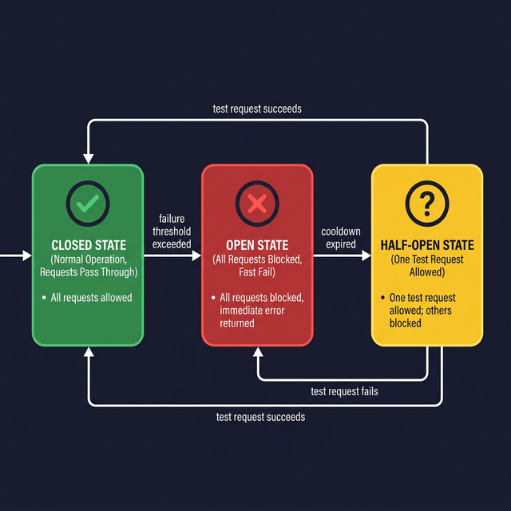

# Error Handling & Retries

> Learn how to build resilient LLM integrations with proper error handling, exponential backoff, and circuit breaker patterns.

## Introduction

LLM APIs are external services, and external services fail. Rate limits, timeouts, server errors, network blips — if your code doesn't handle these gracefully, your application will feel fragile and unreliable. The user doesn't care _why_ it failed; they care that it works.

The good news is that most LLM API errors are **transient** — they go away if you try again after a short wait. That makes retry logic incredibly effective. But naive retries (just hammering the endpoint) make things worse. You need structured strategies: exponential backoff, rate limit awareness, and circuit breakers.

## Core Concepts

### Common API Errors

Both OpenAI and Anthropic return standard HTTP error codes. Know the ones you'll see most often:

```typescript
// Error codes and what they mean
const ERROR_GUIDE = {
  400: "Bad Request — malformed input (fix your code, don't retry)",
  401: "Unauthorized — invalid API key (fix your key, don't retry)",
  403: "Forbidden — insufficient permissions (check your plan/key)",
  404: "Not Found — invalid model or endpoint",
  429: "Rate Limited — too many requests (RETRY with backoff)",
  500: "Internal Server Error — provider issue (RETRY with backoff)",
  502: "Bad Gateway — provider issue (RETRY with backoff)",
  503: "Service Unavailable — overloaded (RETRY with backoff)",
  529: "Overloaded — Anthropic-specific (RETRY with backoff)",
};
```

The key insight: only **retry on transient errors** (429, 5xx). Retrying a 400 or 401 is pointless — those need code changes.

### Exponential Backoff

**Exponential backoff** increases the delay between retries, giving the server time to recover:

```typescript
async function withRetry<T>(
  fn: () => Promise<T>,
  options: {
    maxRetries?: number;
    baseDelayMs?: number;
    maxDelayMs?: number;
  } = {},
): Promise<T> {
  const { maxRetries = 3, baseDelayMs = 1000, maxDelayMs = 30000 } = options;

  for (let attempt = 0; attempt <= maxRetries; attempt++) {
    try {
      return await fn();
    } catch (error: any) {
      const status = error?.status ?? error?.statusCode;
      const isRetryable = status === 429 || (status >= 500 && status < 600);

      if (!isRetryable || attempt === maxRetries) {
        throw error;
      }

      // Exponential delay with jitter to avoid thundering herd
      const delay = Math.min(
        baseDelayMs * Math.pow(2, attempt) + Math.random() * 1000,
        maxDelayMs,
      );

      console.warn(
        `Attempt ${attempt + 1} failed (${status}). Retrying in ${Math.round(delay)}ms...`,
      );
      await new Promise((resolve) => setTimeout(resolve, delay));
    }
  }

  throw new Error("Unreachable");
}
```

The **jitter** (random addition) prevents the "thundering herd" problem — if many clients back off to the exact same time, they'll all retry simultaneously and cause another spike.

### Rate Limit Handling

When you hit a rate limit (429), the API usually tells you when to retry via the `Retry-After` header:

```typescript
async function withRateLimitHandling<T>(fn: () => Promise<T>): Promise<T> {
  try {
    return await fn();
  } catch (error: any) {
    if (error?.status === 429) {
      // Check for Retry-After header
      const retryAfter = error.headers?.["retry-after"];
      const waitMs = retryAfter ? parseInt(retryAfter, 10) * 1000 : 5000;

      console.warn(`Rate limited. Waiting ${waitMs}ms before retry...`);
      await new Promise((resolve) => setTimeout(resolve, waitMs));

      return fn(); // single retry after the wait
    }
    throw error;
  }
}

// Usage
const response = await withRateLimitHandling(() =>
  openai.chat.completions.create({
    model: "gpt-4o",
    messages: [{ role: "user", content: "Hello" }],
  }),
);
```

### Circuit Breaker Pattern

If an API is consistently failing, retrying every request wastes resources and increases latency. A **circuit breaker** "trips" after a threshold of failures and stops making calls for a cooldown period:

```typescript
class CircuitBreaker {
  private failures = 0;
  private lastFailureTime = 0;
  private state: "closed" | "open" | "half-open" = "closed";

  constructor(
    private threshold: number = 5,
    private cooldownMs: number = 30000,
  ) {}

  async call<T>(fn: () => Promise<T>): Promise<T> {
    if (this.state === "open") {
      if (Date.now() - this.lastFailureTime > this.cooldownMs) {
        this.state = "half-open"; // allow one test request
      } else {
        throw new Error("Circuit breaker is open — service unavailable");
      }
    }

    try {
      const result = await fn();
      this.onSuccess();
      return result;
    } catch (error) {
      this.onFailure();
      throw error;
    }
  }

  private onSuccess() {
    this.failures = 0;
    this.state = "closed";
  }

  private onFailure() {
    this.failures++;
    this.lastFailureTime = Date.now();
    if (this.failures >= this.threshold) {
      this.state = "open";
      console.warn(`Circuit breaker tripped after ${this.failures} failures`);
    }
  }
}

// Usage
const breaker = new CircuitBreaker(5, 30000);

const response = await breaker.call(() =>
  openai.chat.completions.create({
    model: "gpt-4o",
    messages: [{ role: "user", content: "Hello" }],
  }),
);
```

### Combining Strategies

In practice, you layer these patterns together:

```typescript
const breaker = new CircuitBreaker(5, 30000);

async function callLLM(prompt: string) {
  return breaker.call(() =>
    withRetry(
      () =>
        openai.chat.completions.create({
          model: "gpt-4o",
          messages: [{ role: "user", content: prompt }],
        }),
      { maxRetries: 3, baseDelayMs: 1000 },
    ),
  );
}
```

This gives you: retry with backoff for transient errors → circuit break if failures persist → fast fail when the circuit is open.

## Visual Aids



## Key Takeaways

- Only **retry transient errors** (429, 5xx) — client errors (4xx) need code fixes
- **Exponential backoff with jitter** prevents overloading the API during recovery
- Read the `Retry-After` header for **rate limit** responses to know exactly when to retry
- **Circuit breakers** protect your app when an API is down for extended periods
- Layer strategies: retry → rate limit handling → circuit breaker for maximum resilience
- Always log retries and failures — you need observability into API reliability

## Further Reading

- [OpenAI Rate Limits](https://platform.openai.com/docs/guides/rate-limits)
- [Anthropic Rate Limits](https://docs.anthropic.com/en/api/rate-limits)
- [Exponential Backoff — AWS Architecture Blog](https://aws.amazon.com/blogs/architecture/exponential-backoff-and-jitter/)
- [Circuit Breaker Pattern — Martin Fowler](https://martinfowler.com/bliki/CircuitBreaker.html)

