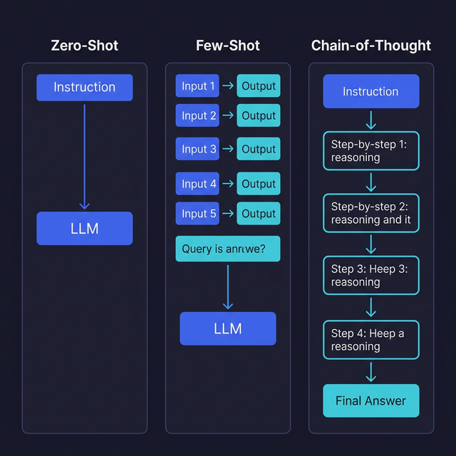

# Zero-Shot, Few-Shot, Chain-of-Thought

> Learn the three foundational prompting strategies and when to reach for each one.

## Introduction

Every time you write a prompt, you're making a choice — even if you don't realize it. Do you just describe what you want and hope the model figures it out? Do you show it some examples first? Or do you walk it through the reasoning step by step?

These three approaches — **zero-shot**, **few-shot**, and **chain-of-thought** — are the building blocks of prompt engineering. They aren't mutually exclusive; you can (and often should) combine them. Understanding when each shines and when it falls short is the difference between getting "meh" output and consistently useful results.

Think of it like teaching a new developer: sometimes you describe the task, sometimes you show them finished examples, and sometimes you walk through the logic together. Same idea, different student.

## Core Concepts

### Zero-Shot Prompting

**Zero-shot** means asking the model to perform a task with no examples — just instructions. It relies entirely on what the model already knows from training.

```typescript
const messages = [
  { role: "system", content: "You are a sentiment analysis classifier." },
  {
    role: "user",
    content: 'Classify the sentiment of this review as positive, negative, or neutral: "The battery lasts forever but the screen is terrible."',
  },
];
```

Zero-shot works surprisingly well for tasks the model has seen many times during training (classification, summarization, translation). It breaks down when the task is niche, needs a specific output format, or requires domain expertise the model wasn't heavily trained on.

**When to use**: simple, well-defined tasks; rapid prototyping; when you don't have examples handy.

### Few-Shot Prompting

**Few-shot** means providing 2–5 examples of the input/output pattern before the actual request. The model picks up on the pattern and mimics it — no fine-tuning required.

```typescript
const messages = [
  {
    role: "system",
    content: "You extract product names and prices from descriptions.",
  },
  {
    role: "user",
    content: 'Extract: "Get the new AirPods Pro for $249."',
  },
  {
    role: "assistant",
    content: '{"product": "AirPods Pro", "price": 249}',
  },
  {
    role: "user",
    content: 'Extract: "MacBook Air M3 starts at $1,099."',
  },
  {
    role: "assistant",
    content: '{"product": "MacBook Air M3", "price": 1099}',
  },
  {
    role: "user",
    content: 'Extract: "The Pixel 9 Pro is available for $999."',
  },
];
```

The model sees the pattern — "given a sentence, return JSON with `product` and `price`" — and follows it. Few-shot is like pair programming: you show the convention, and the model follows it.

**When to use**: custom output formats; domain-specific extraction; when zero-shot gives inconsistent results.

### Chain-of-Thought (CoT) Prompting

**Chain-of-thought** asks the model to reason step by step before giving its final answer. Instead of jumping straight to a conclusion, it "shows its work." This dramatically improves performance on math, logic, and multi-step reasoning tasks.

```typescript
const messages = [
  {
    role: "system",
    content:
      "You are a careful reasoning assistant. Think step by step before giving your final answer.",
  },
  {
    role: "user",
    content:
      "A store sells laptops for $800. They offer a 15% discount, then charge 8% tax on the discounted price. What's the final price?",
  },
];
```

You can also combine CoT with few-shot by including examples that show the reasoning process:

```typescript
const messages = [
  { role: "user", content: "If a train travels 120km in 2h, what is the speed?" },
  {
    role: "assistant",
    content:
      "Step 1: I need to find the speed.\nStep 2: Speed = distance / time = 120km / 2h = 60km/h.\nAnswer: 60 km/h",
  },
  {
    role: "user",
    content:
      "A store sells laptops for $800 with a 15% discount, then 8% tax on the discounted price. Final price?",
  },
];
```

**When to use**: math and logic problems; multi-step reasoning; debugging tasks; any time you need the model to "think" before answering.

### Strategy Decision Matrix

| Scenario                              | Strategy   | Why                                    |
| ------------------------------------- | ---------- | -------------------------------------- |
| Simple classification                 | Zero-shot  | Model already knows the pattern        |
| Custom JSON extraction                | Few-shot   | Show the exact format you want         |
| Math / multi-step logic               | CoT        | Prevents the model from jumping ahead  |
| Complex task with specific format     | Few-shot + CoT | Combines example patterns with reasoning |
| Quick prototype                       | Zero-shot  | Fastest to iterate                     |

## Visual Aids



## Key Takeaways

- **Zero-shot** relies on the model's training — great for common tasks, brittle for niche ones
- **Few-shot** teaching by example — 2–5 examples are usually enough to set the pattern
- **Chain-of-thought** forces step-by-step reasoning and dramatically improves accuracy for logic tasks
- Strategies combine: few-shot CoT is often the most powerful approach for complex tasks
- Start with zero-shot, add examples when output is inconsistent, add CoT when reasoning matters

## Further Reading

- [Prompt Engineering Guide — Prompting Techniques](https://www.promptingguide.ai/techniques)
- [OpenAI — Prompt Engineering Best Practices](https://platform.openai.com/docs/guides/prompt-engineering)
- [Wei et al. — Chain-of-Thought Prompting (2022)](https://arxiv.org/abs/2201.11903)
- [Brown et al. — Language Models are Few-Shot Learners (2020)](https://arxiv.org/abs/2005.14165)

---

## 🧭 Navigation

### Practice This

- 🏋️ [Exercise: Build a Prompt Strategy Selector](../../exercises/block-02/ex-01-prompt-strategies/)
- 🔧 [Tool: prompt-tester.ts](../../tools/prompt-tester.ts)

### Continue Reading

- ➡️ Next: [System vs User vs Assistant Roles](02-system-vs-user-vs-assistant-roles.md)
- 📚 [Back to Block Index](README.md)
