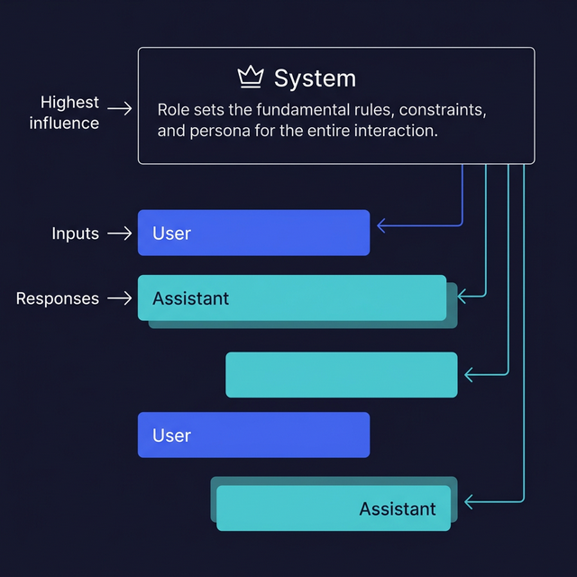

# System vs User vs Assistant Roles

> Understand how message roles shape model behavior and how to design effective role architectures.

## Introduction

When you call a chat completions API, every message has a **role**: `system`, `user`, or `assistant`. These aren't just labels — they fundamentally change how the model interprets and weighs the content. The system message is your backstage pass: it sets the rules before the curtain goes up.

Getting the role architecture right is like designing a good API contract. The system message defines the interface, the user messages are the requests, and the assistant messages set the tone for responses. A well-crafted system prompt can transform a generic model into a focused, consistent tool — no fine-tuning required.

Mastering roles is arguably the highest-leverage prompt engineering skill you can develop. A great system prompt eliminates entire categories of unwanted behavior up front.

## Core Concepts

### The Three Roles

```typescript
const messages = [
  {
    role: "system",
    content: "You are a senior TypeScript developer who writes concise, idiomatic code.",
  },
  {
    role: "user",
    content: "Write a function to debounce async calls.",
  },
  {
    role: "assistant",
    content: "```typescript\nfunction debounceAsync<T>(...) { ... }\n```",
  },
  {
    role: "user",
    content: "Add a cancel method.",
  },
];
```

- **`system`** — Processed first, sets the persona, rules, and constraints. Think of it as the model's "job description." It has the highest influence on behavior.
- **`user`** — The human's messages. Each new user message drives the next response.
- **`assistant`** — Previous model replies. Including assistant messages creates conversational context and teaches the model the expected response style.

### Crafting Effective System Prompts

A strong system prompt has four components:

```typescript
const systemPrompt = `You are CodeReviewer, a senior software engineer specialized in TypeScript.

ROLE: Review code for bugs, performance issues, and style violations.
RULES:
- Always explain WHY something is a problem, not just WHAT
- Rate severity as: critical, warning, or nit
- If the code is fine, say so — don't invent issues
- Never modify the code, only comment on it

OUTPUT FORMAT:
Respond with a markdown list. Each item starts with [severity] and includes
the line reference, the issue, and the reason.`;
```

The four components are:
1. **Identity** — who the model is ("You are CodeReviewer…")
2. **Task** — what it should do ("Review code for bugs…")
3. **Rules** — constraints and behaviors ("Never modify the code…")
4. **Format** — how to structure output ("Respond with a markdown list…")

### Persona Shaping

Different personas produce dramatically different outputs. Compare:

```typescript
// Technical persona
const technical = "You are a database architect. Explain concepts using SQL examples and data modeling terminology.";

// Beginner-friendly persona
const beginner = "You are a patient mentor teaching someone their first programming language. Use simple analogies and avoid jargon.";

// Terse persona
const terse = "You are a Unix philosophy adherent. Respond in as few words as possible. No fluff.";
```

The persona doesn't just change the tone — it changes what the model considers relevant, how deep it goes, and what it assumes the reader already knows.

### Multi-Turn Role Injection

You can inject **assistant messages you write yourself** to steer the conversation. This is called "pre-filling" or "role priming":

```typescript
const messages = [
  {
    role: "system",
    content: "You are a JSON-only API. Never output anything except valid JSON.",
  },
  {
    role: "user",
    content: "List three JavaScript frameworks.",
  },
  {
    role: "assistant",
    content: '{"frameworks": [',  // pre-fill forces JSON continuation
  },
];
```

By starting the assistant's response, you constrain what comes next. This is especially powerful for enforcing output format (more on this in the next topic).

### Role Priority and Conflicts

What happens when system and user messages conflict? The model generally prioritizes:

1. **System prompt** — strongest influence, especially on format and constraints
2. **Most recent messages** — recency bias means later messages have more weight
3. **User vs system** — if a user asks "ignore all previous instructions," a well-designed system prompt usually holds, but not always

This is why **guardrails** (covered in topic 05) matter: you can't rely on the system prompt alone to prevent all misuse.

## Visual Aids



## Key Takeaways

- The **system message** is the single most powerful lever for shaping model behavior
- Structure system prompts with: identity, task, rules, and output format
- **Personas** change not just tone but depth, relevance, and assumptions
- Injecting assistant messages ("pre-filling") can force specific output patterns
- System prompts generally win over user messages, but aren't bulletproof — add guardrails

## Further Reading

- [OpenAI — System Messages Best Practices](https://platform.openai.com/docs/guides/prompt-engineering/strategy-write-clear-instructions)
- [Anthropic — System Prompts Guide](https://docs.anthropic.com/en/docs/build-with-claude/prompt-engineering/system-prompts)
- [Anthropic — Prompt Engineering Interactive Tutorial](https://docs.anthropic.com/en/docs/build-with-claude/prompt-engineering/overview)

---

## 🧭 Navigation

### Practice This

- 🏋️ [Exercise: Craft a System Prompt Builder](pathname:///exercises/block-02/ex-02-system-prompt-builder/)

### Continue Reading

- ⬅️ Previous: [Zero-Shot, Few-Shot, Chain-of-Thought](01-zero-shot-few-shot-chain-of-thought.md)
- ➡️ Next: [Output Formatting](03-output-formatting.md)
- 📚 [Back to Block Index](README.md)
