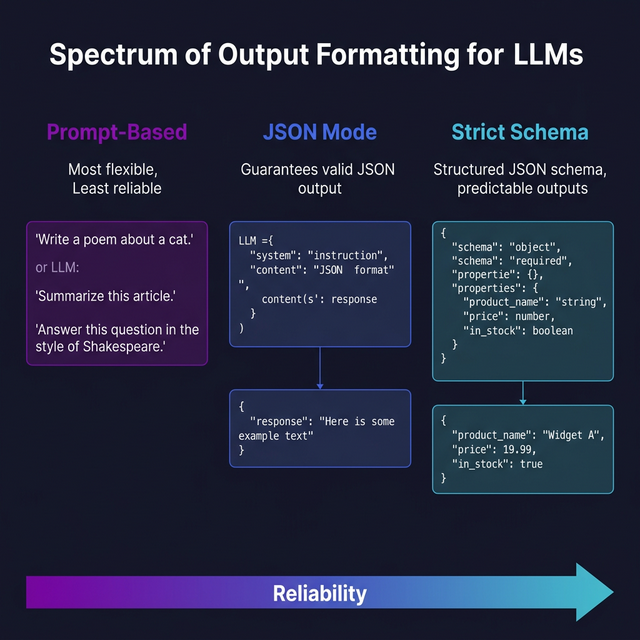

import Quiz from '@site/src/components/Quiz';

# Output Formatting

> Learn how to get LLMs to return structured, machine-readable output every time.

## Introduction

Getting free-text answers from an LLM is easy. Getting a perfectly formatted JSON object that your code can actually parse? That's where things get interesting. Unstructured output is fine for chatbots, but the moment you need to feed model output into another system — a database, a UI component, an API — you need structure.

The good news: modern LLMs and APIs now offer built-in tools for structured output. Between JSON mode, response schemas, and good old-fashioned prompt engineering, you can get machine-readable output reliably. The trick is knowing which tool to reach for and when.

Think of it as the difference between asking a colleague to "describe the bug" versus asking them to "fill out this bug report template." Same information, wildly different usability.

## Core Concepts

### JSON Mode

Both OpenAI and Anthropic offer a **JSON mode** that guarantees the output is valid JSON (though not necessarily the JSON you want):

```typescript
// OpenAI JSON mode
const response = await openai.chat.completions.create({
  model: "gpt-4o",
  response_format: { type: "json_object" },
  messages: [
    {
      role: "system",
      content:
        'Analyze the sentiment of the given text. Respond with JSON: {"sentiment": "positive"|"negative"|"neutral", "confidence": 0-1}',
    },
    {
      role: "user",
      content: "This product changed my life. Absolutely incredible.",
    },
  ],
});

const result = JSON.parse(response.choices[0].message.content);
// { sentiment: "positive", confidence: 0.95 }
```

JSON mode ensures valid JSON but doesn't enforce a specific schema. You need to describe the shape in your prompt.

### Structured Output with Schemas

OpenAI's **Structured Outputs** go further — you define a JSON Schema and the model is guaranteed to match it:

```typescript
const response = await openai.chat.completions.create({
  model: "gpt-4o",
  response_format: {
    type: "json_schema",
    json_schema: {
      name: "sentiment_analysis",
      strict: true,
      schema: {
        type: "object",
        properties: {
          sentiment: {
            type: "string",
            enum: ["positive", "negative", "neutral"],
          },
          confidence: { type: "number" },
          keywords: { type: "array", items: { type: "string" } },
        },
        required: ["sentiment", "confidence", "keywords"],
        additionalProperties: false,
      },
    },
  },
  messages: [
    { role: "user", content: "Analyze: 'The food was good but the service was slow.'" },
  ],
});
```

With `strict: true`, the output is **guaranteed** to conform to your schema. No parsing errors, no missing fields, no surprises.

### Prompt-Based Formatting

When API-level features aren't available (or you want provider-agnostic code), use the prompt itself to enforce format:

```typescript
const systemPrompt = `You are a data extraction assistant.

IMPORTANT: Always respond with ONLY valid JSON, no markdown, no prose.
Use this exact schema:
{
  "entities": [
    {
      "name": "<string>",
      "type": "person" | "company" | "location",
      "confidence": <number 0-1>
    }
  ]
}

If no entities are found, return: {"entities": []}`;
```

Combine this with few-shot examples (from topic 01) for even more reliable formatting.

### Parsing and Validation in Code

Never trust model output blindly — even with JSON mode. Always validate:

```typescript
import { z } from "zod";

// Define your schema with Zod
const SentimentSchema = z.object({
  sentiment: z.enum(["positive", "negative", "neutral"]),
  confidence: z.number().min(0).max(1),
  keywords: z.array(z.string()),
});

type SentimentResult = z.infer<typeof SentimentSchema>;

function parseSentiment(raw: string): SentimentResult {
  const parsed = JSON.parse(raw);
  return SentimentSchema.parse(parsed); // throws ZodError if invalid
}
```

**Zod** is the go-to library for runtime schema validation in TypeScript. It gives you type safety and runtime validation in one place.

### Markdown and Custom Formats

Not everything needs to be JSON. Sometimes you want the model to output markdown tables, XML, YAML, or custom delimited formats:

```typescript
const systemPrompt = `Respond using this exact format:

SUMMARY: <one sentence>
CATEGORY: <bug|feature|question>
PRIORITY: <low|medium|high>
TAGS: <comma-separated list>`;
```

For custom formats, parse them with simple string operations or regex. The key is being extremely explicit about the format in the prompt and validating the output in code.

## Visual Aids



## Key Takeaways

- **JSON mode** ensures valid JSON but doesn't enforce a specific structure
- **Structured Outputs** (with JSON Schema) guarantee the exact shape you need
- **Prompt-based formatting** works across providers but is less reliable on its own
- Always **validate** model output with a runtime library like Zod
- Mix strategies: use API features when available, fall back to prompt-based when not

## Further Reading

- [OpenAI — Structured Outputs Guide](https://platform.openai.com/docs/guides/structured-outputs)
- [OpenAI — JSON Mode](https://platform.openai.com/docs/guides/text-generation/json-mode)
- [Zod — TypeScript Schema Validation](https://zod.dev/)
- [Anthropic — Tool Use for Structured Output](https://docs.anthropic.com/en/docs/build-with-claude/tool-use)

## Knowledge Check

<Quiz 
  questions={[
    {
      text: "What is the primary difference between 'JSON mode' and 'Structured Outputs' in the OpenAI API?",
      options: [
        "JSON mode is faster, but Structured Outputs is cheaper.",
        "JSON mode only guarantees valid JSON syntax, while Structured Outputs guarantees the output will match a specific JSON Schema exactly.",
        "JSON mode is for images, while Structured Outputs is for text.",
        "There is no difference; they are two names for the same feature."
      ],
      correctAnswerIndex: 1,
      explanation: "JSON mode ensures you don't get 'broken' JSON, but Structured Outputs (with `strict: true`) ensures the model includes every required field and follows every data type you've defined."
    },
    {
      text: "Why is it still important to use a validation library like Zod even when using an API's built-in formatting features?",
      options: [
        "To make the model's response time shorter.",
        "As a 'defense-in-depth' measure to ensure your application code has full type-safety and catches any unexpected edge cases.",
        "Because Zod is required by the OpenAI SDK.",
        "To translate the JSON into another language automatically."
      ],
      correctAnswerIndex: 1,
      explanation: "Validation libraries provide a safe 'boundary' that protects your core business logic from potentially malformed or unexpected data coming from the model."
    },
    {
      text: "How do you define the exact shape of the output using OpenAI's Structured Outputs?",
      options: [
        "By writing a long paragraph in the system prompt.",
        "By providing a JSON Schema object in the `response_format` parameter.",
        "By uploading a CSV file with examples.",
        "You can't; the model chooses the shape itself."
      ],
      correctAnswerIndex: 1,
      explanation: "Structured Outputs rely on standard JSON Schema definitions to specify fields, types, required properties, and constraints like enums."
    },
    {
      text: "When API-level formatting features aren't available, what is the best strategy to get consistent JSON?",
      options: [
        "Use 'role priming' (assistant pre-filling) combined with few-shot examples and explicit instructions in the system prompt.",
        "Just hope for the best and retry if it fails.",
        "Tell the model you will fire it if it doesn't return JSON.",
        "Ask the model to send the result via email instead."
      ],
      correctAnswerIndex: 0,
      explanation: "A combination of a strong system prompt and starting the model's response (e.g., with '{') is the most reliable fallback strategy."
    },
    {
      text: "What does the `strict: true` setting do in an OpenAI response schema?",
      options: [
        "It makes the model's tone more professional.",
        "It forces the model to strictly follow the provided JSON Schema, treating any deviation as a failure at the model-generation level.",
        "It prevents the model from using emojis.",
        "It restricts the model to only using 100 tokens."
      ],
      correctAnswerIndex: 1,
      explanation: "Strict mode ensures that the model's internal sampling is constrained to only generate tokens that are valid according to your specific logic and schema."
    }
  ]}
/>


