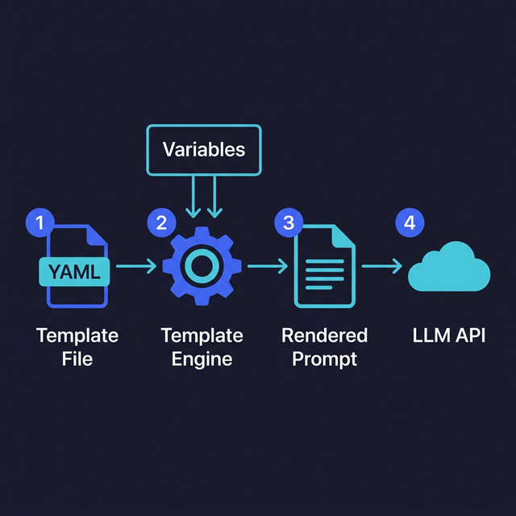

import Quiz from '@site/src/components/Quiz';

# Prompt Templates & Variables

> Build reusable, dynamic prompts that adapt to different inputs without rewriting the whole thing.

## Introduction

Hardcoding prompts is fine for a quick experiment. But as soon as you build something real — a product, an internal tool, a pipeline — you'll find yourself copying and tweaking the same prompt over and over. That's a maintenance nightmare waiting to happen.

**Prompt templates** solve this the same way HTML templates solved static web pages: you write the structure once and inject variables at runtime. The prompt becomes a function, not a string. This makes your prompts reusable, testable, and versionable (more on that in topic 06).

Think of it like moving from inline SQL to parameterized queries. The logic stays the same, but the data changes per request.

## Core Concepts

### Simple String Templates

The simplest approach uses template literals:

```typescript
function buildReviewPrompt(code: string, language: string): string {
  return `Review the following ${language} code for bugs and style issues.
Focus on:
- Potential runtime errors
- Performance issues
- Naming conventions

Code:
\`\`\`${language}
${code}
\`\`\`

Respond with a list of issues found, or say "No issues found." if the code is clean.`;
}

const prompt = buildReviewPrompt(userCode, "typescript");
```

This works but breaks down when prompts get complex, when non-developers need to edit them, or when you want to store prompts separately from code.

### Template Objects

A better pattern separates the template from the variables and metadata:

```typescript
interface PromptTemplate {
  name: string;
  version: string;
  system: string;
  user: string;
  defaults?: Record<string, string>;
}

const sentimentTemplate: PromptTemplate = {
  name: "sentiment-analyzer",
  version: "1.2.0",
  system:
    "You are a sentiment analysis engine. Respond with JSON only: {sentiment, confidence, reasoning}.",
  user: "Analyze the sentiment of this {{language}} text:\n\n{{text}}",
  defaults: { language: "English" },
};

function renderTemplate(
  template: string,
  variables: Record<string, string>,
): string {
  return template.replace(/\{\{(\w+)\}\}/g, (_, key) => {
    if (!(key in variables)) {
      throw new Error(`Missing template variable: ${key}`);
    }
    return variables[key];
  });
}

const userMessage = renderTemplate(sentimentTemplate.user, {
  language: "Spanish",
  text: "Este producto es increíble, me encanta.",
});
```

This pattern gives you named templates, version tracking, default values, and clear separation between structure and data.

### Multi-Section Templates

For complex prompts with multiple dynamic sections, use a builder pattern:

```typescript
interface Section {
  label: string;
  content: string;
  conditional?: boolean;
}

function buildPrompt(sections: Section[]): string {
  return sections
    .filter((s) => s.conditional !== false)
    .map((s) => `## ${s.label}\n\n${s.content}`)
    .join("\n\n");
}

const prompt = buildPrompt([
  { label: "Context", content: `You are analyzing a ${repoName} codebase.` },
  { label: "Task", content: "Identify dead code and unused exports." },
  {
    label: "Previous Analysis",
    content: previousResults,
    conditional: previousResults.length > 0,
  },
  { label: "Output Format", content: "Return JSON array of {file, line, reason}." },
]);
```

Conditional sections let you add context only when it's relevant — no "Previous Analysis: none" cluttering the prompt.

### Template Libraries

For production use, consider a lightweight template library instead of rolling your own:

```typescript
// Using Handlebars-style syntax (many libraries support this)
import Handlebars from "handlebars";

const template = Handlebars.compile(`
Summarize the following {{documentType}} in {{language}}.

{{#if maxLength}}Keep the summary under {{maxLength}} words.{{/if}}

Document:
{{content}}
`);

const prompt = template({
  documentType: "technical RFC",
  language: "English",
  maxLength: 200,
  content: rfcText,
});
```

Libraries give you conditionals, loops, partials (reusable sub-templates), and escaping out of the box.

### Storing Templates Externally

Keep templates in files, not buried in code:

```
prompts/
├── sentiment-analyzer.yaml
├── code-reviewer.yaml
└── summarizer.yaml
```

```yaml
# prompts/code-reviewer.yaml
name: code-reviewer
version: "2.0.0"
model: gpt-4o
temperature: 0.3
system: |
  You are a senior {{language}} developer performing a code review.
  Focus on: correctness, performance, readability.
user: |
  Review this code:

  ```{{language}}
  {{code}}
  ```
```

This approach enables non-developers to edit prompts, simplifies A/B testing, and keeps prompts under version control alongside (but separate from) your application code.



## Key Takeaways

- **Template literals** work for simple cases; use template objects for anything production-grade
- Always **validate** that all required variables are provided before rendering
- **Conditional sections** keep prompts lean by omitting irrelevant context
- Store templates in **external files** (YAML, JSON) for easier editing and versioning
- A good prompt template is a function: same structure, different data, consistent output

## Further Reading

- [LangChain — Prompt Templates](https://js.langchain.com/docs/concepts/prompt_templates)
- [Handlebars.js](https://handlebarsjs.com/) — lightweight template engine
- [Mustache — Logic-less Templates](https://mustache.github.io/)
- [OpenAI Cookbook — Prompt Management](https://cookbook.openai.com/)

## Knowledge Check

<Quiz 
  questions={[
    {
      text: "What is a major risk of 'hardcoding' prompts as static strings directly in your source code?",
      options: [
        "The application will crash if the string is too long.",
        "It becomes a maintenance nightmare, making it difficult to update, version, or reuse the same prompt logic across different parts of an app.",
        "Hardcoded strings use 10x more tokens than dynamic templates.",
        "Search engines cannot index hardcoded strings."
      ],
      correctAnswerIndex: 1,
      explanation: "Templates allow you to separate the 'how' (the prompt logic) from the 'what' (the specific data), making your system more modular and maintainable."
    },
    {
      text: "Why is it often recommended to store prompt templates in external files specifically (like YAML or JSON)?",
      options: [
        "External files are always encrypted by the operating system.",
        "It allows non-developers to edit and refine prompts without touching application code, and keeps prompts easily trackable in version control.",
        "External files make the LLM model run faster.",
        "YAML files don't use tokens."
      ],
      correctAnswerIndex: 1,
      explanation: "Decoupling prompts from code enables faster iteration and allows subject matter experts (who might not be developers) to help tune model behavior."
    },
    {
      text: "What is a 'conditional section' in a prompt template builder useful for?",
      options: [
        "Providing the model with a list of 'if/then' logic to follow.",
        "Including or omitting specific context (like previous conversation history) only when it actually exists, keeping the prompt clean.",
        "Checking if the user has a valid subscription before generating a prompt.",
        "Encrypting the prompt before sending it to the API."
      ],
      correctAnswerIndex: 1,
      explanation: "Conditional sections prevent 'dead weight' in your prompts (like 'Previous Results: none'), ensuring every token sent to the model is useful and relevant."
    },
    {
      text: "In the context of the course, how does a prompt template function similarly to a 'parameterized query' in SQL?",
      options: [
        "Both are used to delete databases.",
        "Both provide a fixed structure that remains constant while safely injecting variable data at runtime.",
        "Both require a high-performance GPU to run.",
        "There is no similarity."
      ],
      correctAnswerIndex: 1,
      explanation: "Just as parameterized queries separate data from SQL logic for security and reuse, prompt templates separate data from prompting logic for consistency and maintainability."
    },
    {
      text: "What is a benefit of using a dedicated template library (like Handlebars) over simple JavaScript template literals (`${var}`) for prompts?",
      options: [
        "Handlebars makes your prompt immune to hallucinations.",
        "Libraries provide built-in support for advanced features like loops, partials, and logic-less conditionals out of the box.",
        "Handlebars strings are automatically translated into 50+ languages.",
        "Template literals are deprecated in modern JavaScript."
      ],
      correctAnswerIndex: 1,
      explanation: "Template libraries offer more powerful tools for managing complex, multi-part prompts that would be messy to handle with raw string manipulation."
    }
  ]}
/>


