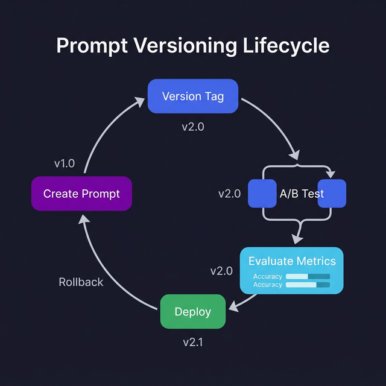

import Quiz from '@site/src/components/Quiz';

# Prompt Versioning

> Track, compare, and iterate on prompts like you version your code.

## Introduction

Prompts are code. They look like plain text, but they have the same lifecycle as any other software artifact: they start as a rough draft, get refined through testing, and evolve as requirements change. Yet most teams treat prompts like magic strings buried in source code, edited in place, and never tested.

**Prompt versioning** brings software engineering discipline to prompt management. You track changes, compare performance across versions, run A/B tests, and roll back when a new prompt performs worse. It's the same principle behind git — but for the text that controls your AI's behavior.

If you've ever changed a prompt and broken something in production, you already know why this matters.

## Core Concepts

### The Prompt Versioning Problem

Without versioning, you end up with:

```typescript
// ❌ What most codebases look like
const prompt = "Summarize this article in 3 bullets"; // v1? v7? Who knows?

// ❌ The "comment archaeology" approach
// OLD: "Summarize this article"
// OLD: "Summarize this article in 3 bullet points, keep it concise"
const prompt = "Summarize this article in exactly 3 bullet points. Each bullet must be one sentence. Be specific, not vague.";
```

You can't tell which version is deployed, compare performance, or roll back safely.

### Version-Tracked Prompt Registry

Build a simple prompt registry that tracks versions:

```typescript
interface PromptVersion {
  version: string;
  template: string;
  model: string;
  temperature: number;
  description: string;
  createdAt: string;
}

interface PromptEntry {
  name: string;
  activeVersion: string;
  versions: PromptVersion[];
}

const promptRegistry: Map<string, PromptEntry> = new Map();

promptRegistry.set("article-summarizer", {
  name: "article-summarizer",
  activeVersion: "2.1.0",
  versions: [
    {
      version: "1.0.0",
      template: "Summarize this article: {{content}}",
      model: "gpt-4o-mini",
      temperature: 0.3,
      description: "Initial version — too vague, inconsistent bullet count",
      createdAt: "2025-01-15",
    },
    {
      version: "2.0.0",
      template:
        "Summarize the following article in exactly 3 bullet points. Each bullet must be a single, specific sentence.\n\nArticle:\n{{content}}",
      model: "gpt-4o",
      temperature: 0.2,
      description: "Added structure requirements — much more consistent",
      createdAt: "2025-02-01",
    },
    {
      version: "2.1.0",
      template:
        "Summarize the following article in exactly 3 bullet points.\nRules:\n- Each bullet is one sentence\n- Be specific: include names, numbers, dates when available\n- Start each bullet with a strong verb\n\nArticle:\n{{content}}",
      model: "gpt-4o",
      temperature: 0.2,
      description: "Added verb-first rule — summaries feel more active and scannable",
      createdAt: "2025-02-10",
    },
  ],
});
```

### File-Based Version Storage

For teams, store prompts in version-controlled files:

```
prompts/
├── article-summarizer/
│   ├── v1.0.0.yaml
│   ├── v2.0.0.yaml
│   ├── v2.1.0.yaml
│   └── active.yaml        → symlink or pointer to v2.1.0.yaml
├── code-reviewer/
│   ├── v1.0.0.yaml
│   └── active.yaml
└── registry.json            # maps prompt names to active versions
```

```yaml
# prompts/article-summarizer/v2.1.0.yaml
name: article-summarizer
version: "2.1.0"
model: gpt-4o
temperature: 0.2
description: "Added verb-first rule for active, scannable summaries"
system: |
  You are a concise article summarizer.
user: |
  Summarize the following article in exactly 3 bullet points.
  Rules:
  - Each bullet is one sentence
  - Be specific: include names, numbers, dates when available
  - Start each bullet with a strong verb

  Article:
  {{content}}
```

Now prompt changes show up in git diffs, PRs get reviewed, and you have a full history.

### A/B Testing Prompts

Compare prompt versions head-to-head:

```typescript
interface ABTestResult {
  version: string;
  input: string;
  output: string;
  latencyMs: number;
  tokenCount: number;
}

async function abTestPrompts(
  versions: PromptVersion[],
  testInputs: string[],
): Promise<ABTestResult[]> {
  const results: ABTestResult[] = [];

  for (const input of testInputs) {
    for (const version of versions) {
      const rendered = renderTemplate(version.template, { content: input });
      const start = Date.now();
      const output = await callLLM(rendered, version.model, version.temperature);
      const latencyMs = Date.now() - start;

      results.push({
        version: version.version,
        input: input.slice(0, 100),
        output,
        latencyMs,
        tokenCount: estimateTokens(rendered + output),
      });
    }
  }

  return results;
}
```

Run the same inputs through multiple versions and compare quality, cost, and speed. You can grade outputs manually, use another LLM as a judge, or check against expected outputs.

### Evaluation Metrics

Track these metrics across versions:

```typescript
interface PromptMetrics {
  version: string;
  accuracy: number;          // % of outputs matching expected behavior
  avgLatencyMs: number;      // response time
  avgTokens: number;         // cost proxy
  formatCompliance: number;  // % of outputs matching expected format
  refusalRate: number;       // % of outputs that are refusals
}

function compareVersions(a: PromptMetrics, b: PromptMetrics): string {
  const improvements: string[] = [];

  if (b.accuracy > a.accuracy)
    improvements.push(`accuracy: ${a.accuracy}→${b.accuracy}`);
  if (b.avgTokens < a.avgTokens)
    improvements.push(`tokens: ${a.avgTokens}→${b.avgTokens}`);
  if (b.formatCompliance > a.formatCompliance)
    improvements.push(`format: ${a.formatCompliance}→${b.formatCompliance}`);

  return improvements.length > 0
    ? `Improvements: ${improvements.join(", ")}`
    : "No improvement detected";
}
```

### When to Create a New Version

Follow semantic versioning for prompts:
- **Patch** (1.0.0 → 1.0.1): Typo fixes, minor wording tweaks
- **Minor** (1.0.0 → 1.1.0): New constraints, format changes, model upgrade
- **Major** (1.0.0 → 2.0.0): Complete prompt rewrite, different output structure

## Visual Aids



## Key Takeaways

- **Treat prompts as code** — version them, review them, test them
- A **prompt registry** maps names to versioned templates with metadata
- Store prompts in **separate files** under version control for team collaboration
- **A/B test** new versions against test inputs before promoting to production
- Track **accuracy, cost, latency, and format compliance** across versions
- Use **semantic versioning**: patch for tweaks, minor for structure changes, major for rewrites

## Further Reading

- [Braintrust — Prompt Versioning](https://www.braintrust.dev/)
- [LangSmith — Prompt Management](https://smith.langchain.com/)
- [Anthropic — Empirical Performance Evaluation](https://docs.anthropic.com/en/docs/build-with-claude/prompt-engineering/be-clear-and-direct)
- [PromptLayer — Prompt Version Control](https://promptlayer.com/)

## Knowledge Check

<Quiz 
  questions={[
    {
      text: "Why is 'prompt versioning' considered a best practice for production AI apps?",
      options: [
        "It makes the model's vocabulary larger.",
        "It allows you to track changes over time, perform A/B testing, and safely roll back if a new prompt version degrades performance.",
        "It is required for the application to be deployed to the web.",
        "It automatically reduces the cost of every API call."
      ],
      correctAnswerIndex: 1,
      explanation: "Prompting is iterative. Versioning ensures that you can measure the impact of changes and maintain a 'known good' state for your application."
    },
    {
      text: "What is a 'Prompt Management System' (or Prompt CMS)?",
      options: [
        "A type of database for storing user passwords.",
        "A dedicated tool or platform for storing, versioning, and deploying prompts separately from application code.",
        "A system for generating random prompts for brainstorming.",
        "A plugin for Microsoft Word."
      ],
      correctAnswerIndex: 1,
      explanation: "Prompt CMS tools help teams collaborate on prompts and deploy updates without needing a full code redeploy for the entire application."
    },
    {
      text: "How does decoupling prompt versions from code deployments benefit the development cycle?",
      options: [
        "It makes the application's binary file smaller.",
        "It allows prompt engineers and product managers to iterate on model behavior without waiting for a new software release.",
        "It prevents the model from ever hallucinating.",
        "It replaces the need for an API key."
      ],
      correctAnswerIndex: 1,
      explanation: "When prompts are hosted externally or in a CMS, you can 'hot-swap' a prompt version in production instantly if an issue is discovered."
    },
    {
      text: "What is a 'golden dataset' in the context of prompt testing?",
      options: [
        "A dataset that is physically stored on gold-plated hard drives.",
        "A set of high-quality, human-reviewed example inputs and their 'ideal' outputs used to benchmark the performance of new prompts.",
        "A list of the most expensive tokens used by the model.",
        "A collection of prompts used by large corporations."
      ],
      correctAnswerIndex: 1,
      explanation: "Golden datasets are the 'ground truth' that you use to verify if a new version of a prompt is actually better (or worse) than the previous one."
    },
    {
      text: "Why should you version your prompts alongside the specific model name and parameters (like temperature)?",
      options: [
        "Because models behave differently even with the same prompt, so a 'version' must include the entire environment to be reproducible.",
        "It is just for organization and has no technical impact.",
        "To make the YAML file look more professional.",
        "Because models might be deleted by the provider at any time."
      ],
      correctAnswerIndex: 0,
      explanation: "A prompt that works perfectly for GPT-4 might fail for Claude or Llama. A 'prompt version' is only meaningful when linked to a specific model configuration."
    }
  ]}
/>

