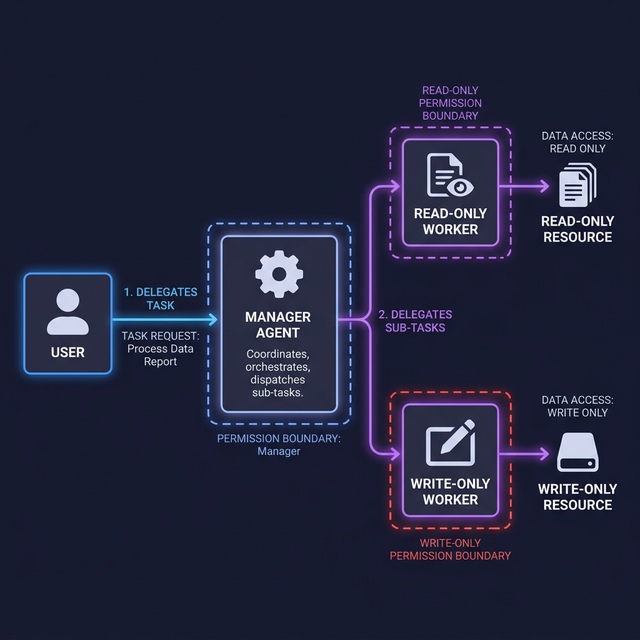

# Agent Authorization & RBAC

> Learn how to define permission boundaries and implement Role-Based Access Control specifically for autonomous AI agents.

## Introduction

In typical software systems, authorization is centered around human users. We grant permissions to "Carlos" or "the Admin Team." However, when we build agents, we are introducing a new type of actor: a software entity that may "think" and "act" on behalf of a user, but also independently.

Assigning the same permissions to an agent as the user who triggered it is a recipe for disaster. If an agent has a "Delete Database" tool and is tricked by a prompt injection, it will delete the database. Agent Authorization (AuthZ) is about defining what an agent **can** do, regardless of what the user is **allowed** to do.

## Core Concepts

### The Principle of Least Privilege (PoLP) for Agents

The primary rule of agent security is: **Never give an agent a tool it doesn't absolutely need.** 

If you are building a "Research Assistant" agent, it needs a "Web Search" tool and perhaps a "Read File" tool. It should **not** have a "Write File" or "Execute Shell" tool by default. By stripping away unnecessary capabilities, you reduce the "blast radius" of any potential exploit.

### Agentic RBAC (Role-Based Access Control)

In a multi-agent system, different agents should have different roles. This allows you to apply RBAC at the agent level.

- **Reader Agent**: Role has `read-only` access to specific documentation folders.
- **Writer Agent**: Role can `create` files in a `/tmp/` directory but cannot `delete` or `read` outside of it.
- **Manager Agent**: Can `delegate` tasks to other agents but has no direct tool access itself.



### Defining Permission Boundaries in Code

When using frameworks like the OpenAI SDK or LangChain, you should enforce authorization at the "Tool definition" level. The LLM sees the tool description, but your backend code verifies the permission before execution.

```typescript
import { tool } from "ai";
import { z } from "zod";

// A secure tool implementation with AuthZ checks
export const secureFileRead = tool({
  description: "Read a file from the user's project directory.",
  parameters: z.object({
    filePath: z.string().describe("The path to the file to read."),
    userId: z.string().describe("The ID of the user triggering the agent."),
  }),
  execute: async ({ filePath, userId }) => {
    // 1. Resolve the path to an absolute path
    const absolutePath = resolvePath(filePath);

    // 2. AuthZ check: Is the agent allowed to access this specific directory?
    if (!isPathAllowed(absolutePath, userId)) {
      return {
        error: "Access Denied: You do not have permission to read files outside the /docs directory.",
      };
    }

    // 3. Perform the actual read
    return await readFile(absolutePath);
  },
});

function isPathAllowed(path: string, userId: string): boolean {
  // Hardcoded boundary for this agent's role
  const ALLOWED_ROOT = `/home/user/projects/${userId}/docs`;
  return path.startsWith(ALLOWED_ROOT);
}
```

By embedding the logic in the `execute` function, the LLM cannot bypass the security check by simply "trying harder" to phrase the request.

## Key Takeaways

- **AuthZ is not AuthN**: Knowing *who* the agent is (Authentication) is different from what it can *do* (Authorization).
- **Narrow Scopes**: Always scope tool access to the smallest possible surface area (e.g., specific directories, specific API endpoints).
- **Decouple Logic**: Keep security logic in your tool execution code, not in the prompt.
- **Agent Roles**: Use multiple specialized agents with limited roles rather than one "God Agent" with all tools.

## Further Reading

- [OWASP Top 10 for LLM Applications — Insecure Output Handling](https://owasp.org/www-project-top-10-for-large-language-model-applications/)
- [Principle of Least Privilege (Wikipedia)](https://en.wikipedia.org/wiki/Principle_of_least_privilege)

import Quiz from '@site/src/components/Quiz';

## Knowledge Check

<Quiz 
  questions={[
    {
      text: "What is the primary difference between standard RBAC and Agentic RBAC?",
      options: [
        "Standard RBAC is for users; Agentic RBAC is for autonomous software actors.",
        "Standard RBAC uses passwords, while Agentic RBAC uses API keys.",
        "There is no difference; they are the same.",
        "Agentic RBAC only applies to local models."
      ],
      correctAnswerIndex: 0,
      explanation: "Standard RBAC focuses on human identities, whereas Agentic RBAC defines permission boundaries for software entities that act independently."
    },
    {
      text: "According to the Principle of Least Privilege for agents, what should be done with unnecessary tools?",
      options: [
        "Keep them in the prompt just in case.",
        "Remove them from the agent's tool registry.",
        "Only allow the agent to use them once per hour.",
        "Disable them only if the LLM fails."
      ],
      correctAnswerIndex: 1,
      explanation: "Least Privilege means stripping away any tool that isn't absolutely necessary for the agent's specific role to reduce the blast radius of potential exploits."
    },
    {
      text: "Where is the most secure place to enforce authorization checks for agentic tools?",
      options: [
        "Inside the system prompt.",
        "Inside the tool's 'execute' function in your backend code.",
        "In the user's browser.",
        "It doesn't matter as long as the LLM is powerful."
      ],
      correctAnswerIndex: 1,
      explanation: "Enforcing security in the code's execute function prevents the LLM from bypassing checks through creative prompting."
    },
    {
      text: "In a multi-agent system, what role might a 'Reader Agent' have?",
      options: [
        "Full administrative access.",
        "Read-only access to specific resource directories.",
        "Ability to delete and create files.",
        "No access to any files."
      ],
      correctAnswerIndex: 1,
      explanation: "Specialized roles like 'Reader' imply limited, specific permissions (read-only) tailored to a single task."
    },
    {
      text: "Why shouldn't an agent always have the same permissions as the user who triggered it?",
      options: [
        "Because agents are faster than humans.",
        "Because a prompt injection could trick the agent into misusing the user's high-level permissions.",
        "Because agents don't have usernames.",
        "Because models cannot handle more than 5 permissions."
      ],
      correctAnswerIndex: 1,
      explanation: "If an agent inherits broad user permissions, it becomes a high-value target for prompt injection attacks that can cause irreversible damage."
    }
  ]}
/>
