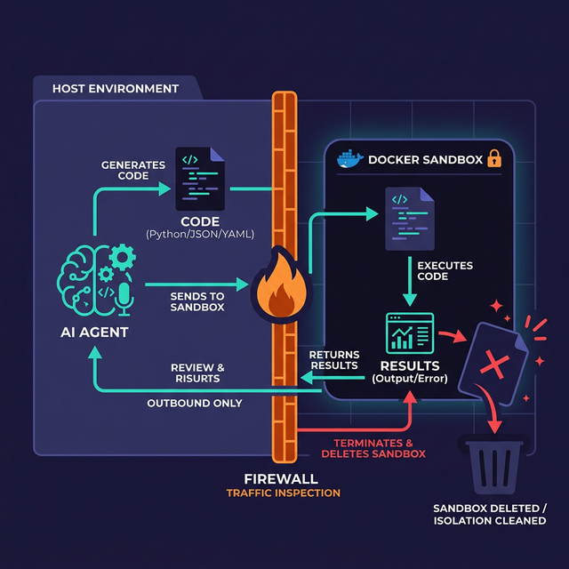

# Execution Sandboxing

> Protect your host system by isolating agent actions in secure, throwaway environments.

## Introduction

Allowing an AI agent to execute code or run shell commands is one of the most powerful capabilities you can provide. It's also the most dangerous. A single prompt injection could trick an agent into running `rm -rf /` or exfiltrating your environment variables.

**Sandboxing** is the practice of running these risky operations in a restricted environment that has no access to the host's primary files, network, or long-term memory. If the agent does something malicious inside a sandbox, the damage is contained and can be wiped clean in milliseconds.

## Core Concepts

### The "Disposable" Environment Pattern

For agents that generate and run code (like data analysts), every execution should happen in a fresh, isolated environment. Once the task is done, the entire environment is destroyed.

1.  **Agent** generates code.
2.  **Host** spins up a lightweight container (e.g., a Docker container or a WebContainer).
3.  **Host** injects only the necessary data files into the container.
4.  **Host** executes the code and captures the output.
5.  **Host** kills the container and returns the output to the agent.



### Sandboxing Technologies

Depending on your architecture, you have several options for sandboxing:

-   **Docker / gVisor**: The industry standard for backend isolation. gVisor adds an extra layer of security by intercepting system calls.
-   **WebContainers**: Allows you to run a full Node.js environment directly in the browser. Perfect for client-side agents.
-   **E2B (Excited to Build)**: A dedicated "Cloud Sandbox" for AI agents that handles the lifecycle of these environments for you.
-   **WASM (WebAssembly)**: Running code compiled to WASM provides near-native performance with high isolation.

### Implementing a Basic Docker Sandbox

Below is a conceptual example of how you might wrap an LLM's code execution in a Docker container using Node.js.

```typescript
import Docker from "dockerode";
import { tool } from "ai";

const docker = new Docker();

export const runCodeSandbox = tool({
  description: "Execute Python code in a secure, isolated environment.",
  parameters: z.object({
    code: z.string().describe("The Python code to execute."),
  }),
  execute: async ({ code }) => {
    // 1. Create a container with resource limits
    const container = await docker.createContainer({
      Image: "python:3.11-slim",
      Cmd: ["python3", "-c", code],
      HostConfig: {
        Memory: 128 * 1024 * 1024, // Limit to 128MB
        CpuQuota: 50000,           // Limit to 50% of 1 CPU core
        NetworkMode: "none",       // Disable all network access
      },
    });

    try {
      // 2. Start and wait for completion (with a timeout)
      await container.start();
      const result = await container.wait();

      // 3. Get logs
      const logs = await container.logs({ stdout: true, stderr: true });
      return { output: logs.toString() };
    } finally {
      // 4. Always cleanup
      await container.remove({ force: true });
    }
  },
});
```

Crucially, we set `NetworkMode: "none"` and strict resource limits (`Memory`, `CpuQuota`). This prevents the agent from making web requests or performing a Denial-of-Service (DoS) attack on the host.

## Key Takeaways

-   **Isolation is Key**: Never run agent-generated code directly on your production server or developer machine.
-   **Network Isolation**: Most sandboxes should have zero network access unless explicitly required.
-   **Resource Limits**: Set strict CPU and Memory limits to prevent runaway loops or resource exhaustion.
-   **Immutable State**: Start every execution from a clean, known image or state.

import Quiz from '@site/src/components/Quiz';

## Further Reading

-   [gVisor Official Documentation](https://gvisor.dev/)
-   [E2B - Sandbox for AI Agents](https://e2b.dev/)
-   [WebContainers by StackBlitz](https://webcontainers.io/)

## Knowledge Check

<Quiz 
  questions={[
    {
      text: "What is the primary benefit of the 'Disposable Environment' pattern?",
      options: [
        "It makes the system faster.",
        "It ensures that a malicious action inside the sandbox does not affect the host and is wiped clean after use.",
        "It reduces the cost of LLM tokens.",
        "It allows the agent to remember state across different sessions."
      ],
      correctAnswerIndex: 1,
      explanation: "Disposable environments isolate risky operations and ensure no persistent damage or state remains after a task is finished."
    },
    {
      text: "Which technology is specifically mentioned as a way to run Node.js in the browser for agent sandboxing?",
      options: [
        "Docker",
        "WebContainers",
        "gVisor",
        "WASM"
      ],
      correctAnswerIndex: 1,
      explanation: "WebContainers allow full Node.js environments to run isolated within the browser environment."
    },
    {
      text: "When implementing a Docker sandbox, what does setting 'NetworkMode: none' accomplish?",
      options: [
        "It makes the agent run offline.",
        "It prevents the agent from making any outbound network requests from within the sandbox.",
        "It speeds up the container startup time.",
        "It hides the agent's IP address."
      ],
      correctAnswerIndex: 1,
      explanation: "Disabling network access is a critical security measure to prevent data exfiltration or scanning of internal networks."
    },
    {
      text: "Why are resource limits (CPU/Memory) important in a sandbox?",
      options: [
        "To save money on cloud bills.",
        "To prevent the agent from performing a Denial-of-Service (DoS) attack through runaway loops.",
        "To make the agent respond faster.",
        "Because LLMs require exactly 128MB of RAM."
      ],
      correctAnswerIndex: 1,
      explanation: "Without resource limits, a malicious or buggy piece of code could consume all host resources, crashing the entire system."
    },
    {
      text: "What does gVisor add to a standard Docker container?",
      options: [
        "A better UI.",
        "An extra layer of security by intercepting and isolating system calls.",
        "Support for more programming languages.",
        "Automatic code generation."
      ],
      correctAnswerIndex: 1,
      explanation: "gVisor acts as a secure kernel that intercepts system calls, providing stronger isolation than standard Linux containers."
    }
  ]}
/>
