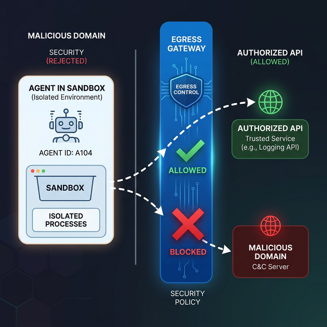

# File & Network Controls

> Restrict agent access to the specific resources they need, and nothing more.

## Introduction

An autonomous agent with "unlimited" internet access or "full" disk access is a massive security liability. An attacker could use a prompt injection to make the agent download malware, exfiltrate data to a malicious domain, or scan your internal network.

To prevent this, we must implement **Egress Filtering** (controlling what the agent can access on the internet) and **Scoped File Systems** (controlling what the agent can see on the disk).

## Core Concepts

### Network Allow-lists (Egress Filtering)

By default, an agent sandbox should have zero outbound internet access. If the agent needs to fetch data from a specific API (e.g., GitHub or a weather service), you should explicitly "allow-list" those domains.

- **Deny-by-default**: Block everything.
- **Service Proxies**: Instead of letting the agent talk to the internet, let it talk to a proxy that handles authentication and logs every request.
- **Domain Blocking**: Prevent access to known malicious domains or high-risk sites (like pastebins).



### Scoped File Systems (Chroot/Bind Mounts)

An agent should never see the entire file system of the machine it's running on. Instead, we use "Bind Mounts" or "Chroot" to give the agent a tiny, isolated view of a single directory.

If an agent is working on `project-alpha`, it should only see `/home/agent/projects/project-alpha`. It should not even be aware that `/etc/passwd` exists.

### Implementing Scoped Access with Node.js `fs`

While sandboxing is the best defense, you can also add application-level guards in your tool implementations.

```typescript
import path from "node:path";
import { tool } from "ai";
import { z } from "zod";

const SAFE_ROOT = path.resolve("./data/agent-workspace");

export const listFiles = tool({
  description: "List files in the authorized workspace.",
  parameters: z.object({
    subDir: z.string().default("."),
  }),
  execute: async ({ subDir }) => {
    // 1. Resolve and normalize the path
    const requestedPath = path.resolve(SAFE_ROOT, subDir);

    // 2. Prevent "Path Traversal" (e.g., ../../../etc)
    if (!requestedPath.startsWith(SAFE_ROOT)) {
      return { error: "Security Error: Attempted to access directory outside of the workspace." };
    }

    // 3. Proceed safely
    const files = await fs.promises.readdir(requestedPath);
    return { files };
  },
});
```

Using `path.resolve` and checking `startsWith` is a standard pattern to prevent **Path Traversal** attacks, where an attacker tries to use `../` to escape the intended directory.

## Key Takeaways

- **Minimum Egress**: Only allow the agent to talk to the specific domains required for its task.
- **Path Sanitization**: Always normalize and validate file paths before usage.
- **Ephemeral Workspaces**: Use temporary directories for agent work and delete them when the session ends.
- **Read-Only by Default**: If an agent only needs to read data, mount its workspace as `read-only`.

## Further Reading

- [Path Traversal Defense (OWASP)](https://cheatsheetseries.owasp.org/cheatsheets/File_Path_Traversal_Prevention_Cheat_Sheet.html)
- [How Egress Filtering Works](https://en.wikipedia.org/wiki/Egress_filtering)

import Quiz from '@site/src/components/Quiz';

## Knowledge Check

<Quiz 
  questions={[
    {
      text: "What is an 'Egress Allow-list' in the context of agent security?",
      options: [
        "A list of users who can use the agent.",
        "A set of specific domains or APIs the agent is permitted to contact.",
        "A list of files the agent can delete.",
        "A collection of safe prompts."
      ],
      correctAnswerIndex: 1,
      explanation: "Egress allow-lists restrict the agent's outbound network traffic to trusted destinations only."
    },
    {
      text: "What vulnerability is mitigated by checking if a requested path starts with a 'SAFE_ROOT' directory?",
      options: [
        "Prompt Injection",
        "Path Traversal (e.g., using ../ to access private files)",
        "Denial of Service",
        "Cross-Site Scripting"
      ],
      correctAnswerIndex: 1,
      explanation: "Validating that a resolved path stays within a safe root directory prevents attackers from escaping the intended workspace."
    },
    {
      text: "What is the security benefit of 'mounting a workspace as read-only'?",
      options: [
        "It makes the agent faster.",
        "It prevents the agent from modifying or deleting existing files, even if it is compromised.",
        "It allows multiple agents to read the same file.",
        "It reduces disk usage."
      ],
      correctAnswerIndex: 1,
      explanation: "If an agent only needs to read data, making the system read-only at the OS/hardware level provides a strong guarantee against data tampering."
    },
    {
      text: "Why is a 'Deny-by-default' network policy recommended for agent sandboxes?",
      options: [
        "Because it is easier to implement.",
        "Because it assumes all outbound traffic is dangerous unless explicitly authorized.",
        "To prevent the agent from talking to the user.",
        "To save bandwidth."
      ],
      correctAnswerIndex: 1,
      explanation: "Deny-by-default is a core security principle that minimizes the attack surface by only permitting known-good traffic."
    },
    {
      text: "Which Node.js module is used to safely resolve and normalize file paths?",
      options: [
        "fs",
        "path",
        "http",
        "crypto"
      ],
      correctAnswerIndex: 1,
      explanation: "The 'path' module provides utilities like 'path.resolve' and 'path.normalize' which are essential for security checks."
    }
  ]}
/>
