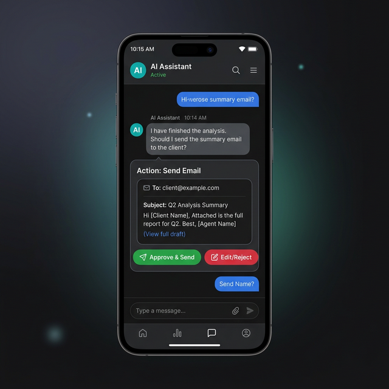

# Human-in-the-loop (HITL)

> Design systems where high-risk agent actions require explicit human approval.

## Introduction

No matter how many guardrails you put in place, LLMs are probabilistic. They will eventually make a mistake. For low-risk actions (like searching the web), this is fine. For high-risk actions (like sending an email, charging a credit card, or deleting a file), it is not.

**Human-in-the-loop (HITL)** is a design pattern where the agent pauses its loop and waits for a human to review and approve its proposed action before continuing.

## Core Concepts

### The "Proposal" Pattern

Instead of an agent executing a tool directly, it generates a "Proposal." This proposal is displayed to the user in a UI, and the agent's execution thread is suspended until the user clicks "Approve" or "Reject."

1. **Agent**: "I want to delete `old_report.pdf`."
2. **System**: Pauses execution. Shows a button: `[Approve Deletion] [Cancel]`.
3. **User**: Clicks `[Approve]`.
4. **System**: Executes the tool and returns the result to the agent.



### Permission Levels

Not all tools require the same level of HITL. You should classify your tools by risk:

- **Level 0 (Auto-execute)**: Safe tools like `web_search`, `calculate`, `summarize`.
- **Level 1 (Notify only)**: The agent executes the tool, but the user receives a notification.
- **Level 2 (Human Approval Required)**: High-risk tools like `delete_file`, `send_transaction`, `execute_script`.

### Implementing HITL in Code

In a modern web app, this usually involves a state machine or a way to "pause" and "resume" agent execution.

```typescript
// Conceptual example using a tool registry that supports approval
const toolRegistry = {
  deleteFile: {
    requiresApproval: true,
    execute: async (path) => { /* ... delete logic ... */ }
  },
  search: {
    requiresApproval: false,
    execute: async (query) => { /* ... search logic ... */ }
  }
};

async function handleAgentAction(action) {
  const tool = toolRegistry[action.toolName];
  
  if (tool.requiresApproval) {
    // 1. Save agent state to database
    await savePendingAction({
      actionId: action.id,
      description: `Agent wants to delete ${action.args.path}`,
      status: 'pending'
    });
    
    // 2. Stop execution and notify UI
    return { status: 'waiting_for_user' };
  }

  // 3. Execute immediately for safe tools
  return await tool.execute(action.args);
}
```

## Key Takeaways

- **Explicit Consent**: For high-stake actions, never assume the agent's intent is correct.
- **Explainability**: The agent should explain *why* it wants to take an action so the user can make an informed decision.
- **Editability**: Allow users to edit the agent's proposed action (e.g., change the email body before it's sent).
- **Audit Trails**: Log who approved which action and when.

## Further Reading

- [Human-in-the-loop (Wikipedia)](https://en.wikipedia.org/wiki/Human-in-the-loop)
- [Designing Agentic Workflows (DeepLearning.ai)](https://www.deeplearning.ai/the-batch/how-agents-can-improve-llm-performance/)

import Quiz from '@site/src/components/Quiz';

## Knowledge Check

<Quiz 
  questions={[
    {
      text: "What is a 'Level 2' tool in a risk-based classification system?",
      options: [
        "A tool that is safe to auto-execute.",
        "A tool that generates a notification after execution.",
        "A high-risk tool that requires explicit human approval before execution.",
        "A tool that only runs in the browser."
      ],
      correctAnswerIndex: 2,
      explanation: "Level 2 tools cover high-risk actions like file deletion or financial transactions that should never be performed without a human's consent."
    },
    {
      text: "What is the primary role of the 'Proposal' pattern in HITL design?",
      options: [
        "To make the agent more persuasive.",
        "To pause agent execution and present a summary of the intended action for human review.",
        "To let the agent propose new features for the app.",
        "To allow the system to automatically reject all actions."
      ],
      correctAnswerIndex: 1,
      explanation: "Proposals act as an interface between the agent's logic and the user's judgment, ensuring high-stakes decisions are verified."
    },
    {
      text: "Why should an agent explain *why* it wants to take an action in a HITL workflow?",
      options: [
        "To improve its personality.",
        "To provide context so the user can make an informed decision rather than clicking 'Approve' blindly.",
        "To increase the token count and improve accuracy.",
        "Because it is required by law."
      ],
      correctAnswerIndex: 1,
      explanation: "Explainability is a cornerstone of safe HITL systems; users need to understand the agent's reasoning to validate its intent."
    },
    {
      text: "What benefit does 'Editability' provide in an approval UI?",
      options: [
        "It allows the user to correct the agent's mistakes (e.g., fixing a typo in a proposed email) before execution.",
        "It makes the UI look more professional.",
        "It prevents the agent from running at all.",
        "It reduces the security of the system."
      ],
      correctAnswerIndex: 0,
      explanation: "Allowing users to tweak proposals turns the system into a collaborative workspace where the human has final, precise control."
    },
    {
      text: "In the provided code example, what happens when a tool 'requiresApproval'?",
      options: [
        "The system executes it immediately and then sends an email.",
        "The system saves the pending action and returns a 'waiting_for_user' status, pausing execution.",
        "The system crashes.",
        "The system asks another agent for approval."
      ],
      correctAnswerIndex: 1,
      explanation: "The code explicitly handles approval-required tools by persisting the state and halting the execution loop until external input is received."
    }
  ]}
/>
