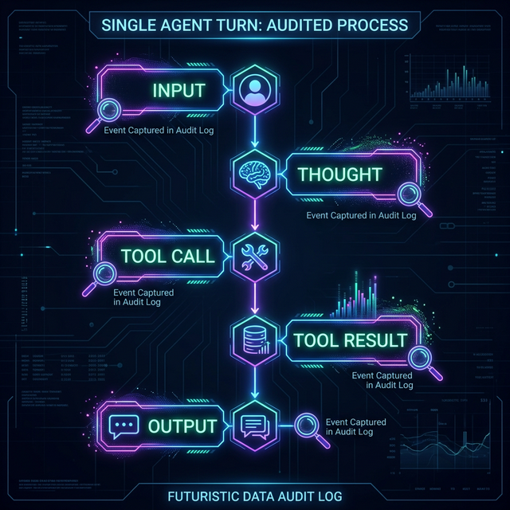

# Audit Logging & Tracing

> Build an immutable trail of agent thoughts, actions, and observations to ensure accountability.

## Introduction

If an agent deletes a file or makes an unauthorized API call, you need to know **why** it happened. Was it a logic error in the code? A prompt injection? Or a misunderstanding of the user's instructions?

**Audit Logging** is the practice of recording every step of the agent's lifecycle. Unlike standard application logs, agent logs must be structured so that you can reconstruct the context of a decision made by an LLM hours or days after the event.

## Core Concepts

### The "Trace" Structure

A high-quality agent log should follow a "Trace" structure, which links the reasoning to the action.

- **Timestamp**: When it happened.
- **Actor**: Which agent/user triggered it.
- **Input**: The raw prompt or message received.
- **Thoughts**: The `thought` or `reasoning` field from the LLM (if using ReAct).
- **Tool Call**: The function name and arguments.
- **Tool Result**: What the outside world returned.
- **Output**: The final response to the user.



### Immutable Audit Logs

For security purposes, these logs should be **immutable**. They should be written to a write-only database or a secure logging service (like AWS CloudWatch or Axiom) where neither the agent nor a regular user can delete them.

This ensures that even if an agent is compromised and tries to "cover its tracks" by deleting its history, the audit trail remains intact.

### Implementing Tracing with OpenTelemetry

The industry standard for distributed tracing is **OpenTelemetry**. Many AI frameworks (like LangChain and Vercel AI SDK) support exporting traces to tools like **LangSmith**, **Arize Phoenix**, or **Honeycomb**.

```typescript
import { generateText } from "ai";
import { otel } from "@vercel/otel";

// Every LLM call is automatically wrapped in a trace span
const { text } = await generateText({
  model: openai("gpt-4o"),
  prompt: "Synthesize the security report...",
  experimental_telemetry: {
    isEnabled: true,
    functionId: "security_synthesizer",
    metadata: {
      userId: "user_123",
      agentRole: "auditor"
    }
  }
});
```

Using telemetry allows you to see the "tree" of calls, especially helpful in multi-agent systems where one agent might call another.

## Key Takeaways

- **No Black Boxes**: Every decision must be traceable back to a specific prompt and tool result.
- **Log the "Thoughts"**: Reasoning traces are essential for debugging "Why did it do that?"
- **Immutable Storage**: Protect your logs from deletion to prevent track-covering.
- **Standard Standards**: Use OpenTelemetry to integrate with existing observability infrastructure.

## Further Reading

- [LangSmith Observability](https://www.langchain.com/langsmith)
- [OpenTelemetry for Developers](https://opentelemetry.io/)
- [Honeycomb - Observability for LLMs](https://www.honeycomb.io/)

import Quiz from '@site/src/components/Quiz';

## Knowledge Check

<Quiz 
  questions={[
    {
      text: "Why is structured 'Tracing' preferred over simple text logging for agents?",
      options: [
        "It uses less disk space.",
        "It allows you to link inputs, thoughts, tool calls, and results into a single, reconstructible chain of events.",
        "It is required by the OpenAI API.",
        "Text logging is not supported in TypeScript."
      ],
      correctAnswerIndex: 1,
      explanation: "Traces provide context by showing the parent-child relationship between an agent's reasoning and the resulting actions."
    },
    {
      text: "What does it mean for an audit log to be 'Immutable'?",
      options: [
        "It is stored in a way that prevents it from being modified or deleted, even by the agent that created it.",
        "It is written in a language that cannot be translated.",
        "It automatically archives itself every 24 hours.",
        "It stands for 'Integrated Multi-Modal Utility'."
      ],
      correctAnswerIndex: 0,
      explanation: "Immutability is a security requirement ensuring the integrity of the audit trail, preventing attackers or rogue agents from hiding their tracks."
    },
    {
      text: "What is the purpose of logging the agent's 'Thoughts' or 'Reasoning' traces?",
      options: [
        "To train a new model.",
        "To help developers debug *why* an agent made a particular decision or tool call.",
        "To provide a more entertaining user experience.",
        "To satisfy legal requirements for 'Explainability' in AI."
      ],
      correctAnswerIndex: 1,
      explanation: "Understanding the 'thought' process is key to identifying whether a security failure was due to bad prompt engineering, poor model logic, or external injection."
    },
    {
      text: "Which industry standard is used for distributed tracing and observability in modern software?",
      options: [
        "OpenSSL",
        "OpenTelemetry",
        "OpenAI",
        "OpenAPI"
      ],
      correctAnswerIndex: 1,
      explanation: "OpenTelemetry is the vendor-neutral standard for capturing and exporting traces, metrics, and logs."
    },
    {
      text: "In a multi-agent system, what does a 'telemetry span' represent?",
      options: [
        "The time it takes for an agent to boot.",
        "A single unit of work (like an LLM call or tool execution) within a larger trace.",
        "The distance between two agents.",
        "The length of the agent's system prompt."
      ],
      correctAnswerIndex: 1,
      explanation: "Spans are the building blocks of traces, representing individual operations that contribute to the overall request lifecycle."
    }
  ]}
/>
